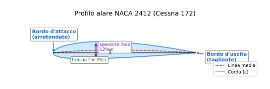
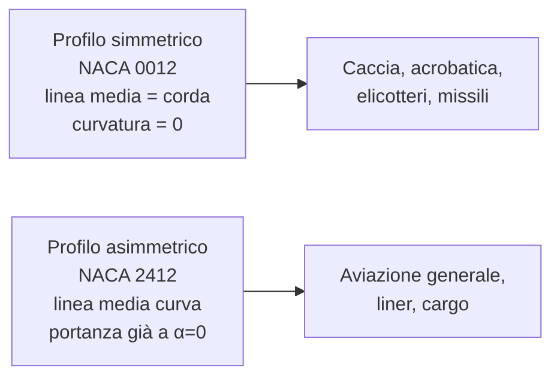

# Lezione 1 — Profilo alare

> **Obiettivo**: alla fine di questa lezione sai riconoscere le parti di un profilo alare, leggere la nomenclatura NACA, e capire perché un caccia e un aliante hanno profili diversi.

---

## 🎯 In una riga

Il **profilo alare** è la **sezione trasversale dell'ala** — la forma che vedi se tagli l'ala con una sega perpendicolare alla sua lunghezza. È la geometria che, immersa nell'aria in movimento, genera la portanza.

---

## ✈️ A cosa serve davvero

L'ala intera è tridimensionale e complicata. Ma se "affetti" l'ala, ottieni una forma 2D molto più semplice da studiare: il profilo. **Tutta la teoria della portanza parte da qui**, da una forma piatta vista di lato.

Profili diversi = velivoli con missioni diverse:

- Profilo spesso e curvo → portanza alta a bassa velocità → aerei da turismo, cargo, aliante
- Profilo sottile e simmetrico → bassa resistenza ad alta velocità → caccia, aerobatica
- Profilo laminare → resistenza minima in crociera → aerei da record di autonomia

---

## 📐 Geometria: le 6 parti che devi conoscere



Il profilo blu è il **NACA 2412** del Cessna 172. La linea tratteggiata rossa è la **linea media** (separa dorso e ventre). La freccia viola misura lo **spessore massimo** (12% della corda). La freccia verde misura la **curvatura massima** (2% della corda, posta al 40% della corda).

| Elemento | Cosa è | Perché conta |
|---|---|---|
| **Bordo d'attacco** | Punto/regione anteriore, di solito arrotondato | Determina come l'aria "incontra" il profilo |
| **Bordo d'uscita** | Punto posteriore, sempre tagliente | Determina come il flusso si stacca dal profilo |
| **Corda (c)** | Segmento rettilineo da bordo d'attacco a bordo d'uscita | È la "lunghezza" del profilo, riferimento per tutto |
| **Spessore (t)** | Distanza max tra dorso e ventre | Influenza resistenza e $C_{L,max}$ |
| **Linea media** | Linea equidistante tra dorso e ventre | Se è retta = profilo simmetrico |
| **Freccia max (curvatura, $f$)** | Distanza max tra linea media e corda | Determina la portanza ad $\alpha = 0$ |

**Tutto si esprime in % della corda**:

- Spessore 12% di corda → se $c = 1$ m, lo spessore max è 12 cm
- Curvatura 2% di corda → $f = 2$ cm

---

## 🔢 Nomenclatura NACA — leggere il profilo come un'etichetta

NACA (oggi NASA) ha catalogato migliaia di profili negli anni '30–'40 con un sistema numerico ancora usato oggi.

### Profili NACA a 4 cifre — `NACA MPXX`

```
NACA  2  4  12
       │  │  ╲___ spessore max in % della corda
       │  ╲────── posizione della curvatura max (in decimi di corda)
       ╲────────── curvatura max in % della corda
```

**Esempio: NACA 2412** (montato sul **Cessna 172** 🛩️):

- **2** → curvatura max = 2% della corda
- **4** → posizione della curvatura max al 40% della corda (4 decimi)
- **12** → spessore max = 12% della corda

### Profili NACA a 5 cifre — `NACA LPSXX`

Più sofisticati, ottimizzati per $C_L$ specifici. Esempio: **NACA 23012** (Beechcraft Bonanza). Le cifre codificano $C_L$ di progetto, posizione curvatura, e spessore. Non serve impararli a memoria — serve saperli **riconoscere** e cercarli nel catalogo.

> 💡 **Trucco**: se vedi **5 cifre** che iniziano con un numero da 1 a 5, è un NACA 5-cifre. Se vedi **4 cifre**, è un 4-cifre.

---

## ⚖️ Profili simmetrici vs asimmetrici (cambered)



| | Simmetrico | Asimmetrico (cambered) |
|---|---|---|
| Linea media | Coincide con la corda | Curva sopra la corda |
| Portanza a $\alpha = 0$ | Zero | Positiva |
| Comportamento invertito | Identico | Cambia segno alla portanza |
| Tipico uso | Acrobatica, caccia | Trasporto, turismo |

**Esempio reale**:

- **NACA 0012**: profilo simmetrico, 12% di spessore, zero curvatura. Usato sugli **stabilizzatori** di moltissimi velivoli (compreso il Cessna 172 — la coda è simmetrica anche se l'ala no).
- **NACA 2412**: asimmetrico, ala del Cessna 172. Genera portanza anche con corda parallela al vento.

---

## 🔬 Profili laminari — il caso speciale

I profili **NACA serie 6** (es. NACA 64-212) sono progettati per mantenere il flusso **laminare** sulla maggior parte del dorso → resistenza ridotta in crociera.

**Famosi**:

- **P-51 Mustang** (caccia WWII): primo aereo da caccia con ala laminare
- **Alianti moderni** (ASK-21, DG-1000): profili laminari spinti con $E_{max} > 40$

**Limite**: sono molto sensibili a sporco, insetti, ghiaccio sul bordo d'attacco. Una mosca schiacciata può rovinare il flusso laminare.

---

## 🎯 Box "Da ricordare per l'interrogazione"

> 1. **Profilo = sezione 2D dell'ala**, definito da bordo d'attacco, bordo d'uscita, corda, dorso, ventre, linea media.
> 2. **NACA 4-cifre `MPXX`**: M = curvatura %, P = posizione curvatura in decimi, XX = spessore %.
> 3. **NACA 2412 = Cessna 172**, esempio canonico di profilo asimmetrico per aviazione generale.
> 4. **Simmetrico ↔ linea media = corda** ↔ portanza nulla a $\alpha = 0$.
> 5. **Profili laminari** = bassa resistenza, alta efficienza, ma fragili al contaminante.

---

## ⚠️ Errori comuni

❌ **"Il profilo genera portanza perché sopra è più curvo"** → mezza verità. La curvatura aiuta ma anche un profilo simmetrico genera portanza con $\alpha > 0$. La portanza dipende sia da geometria che da angolo di attacco.

❌ **Confondere corda con apertura alare** → la corda è la *profondità* dell'ala (avanti-indietro), l'apertura è la *lunghezza* (da tip a tip).

❌ **Pensare che lo spessore in % sia sulla corda standard di 1 m** → è una *percentuale*, va sempre calcolata sulla corda effettiva del velivolo. Se la corda è 2 m e lo spessore 12%, lo spessore in metri è 0,24 m.

❌ **Leggere NACA 2412 come "2,4,1,2"** → sono 4 cifre divise come `2 / 4 / 12`, non `2 / 4 / 1 / 2`. Le ultime due insieme indicano lo spessore.

---

## 🧠 Domande di autoverifica (rispondi a voce, poi controlla sotto)

1. Cosa rappresenta la **5** in NACA 0512?
2. Un velivolo con profilo simmetrico in volo livellato e corda parallela al vento: genera portanza?
3. Il P-51 Mustang ha un profilo laminare. Perché lo si proteggeva ossessivamente dagli insetti?
4. Qual è la differenza tra corda e apertura alare?
5. Se il Cessna 172 ha corda 1,49 m e profilo NACA 2412, quanto vale lo spessore massimo dell'ala in centimetri?

<details markdown="1">
<summary>👉 Risposte</summary>

1. **5** = posizione della curvatura max = al **50%** della corda (5 decimi).
2. **No**, perché simmetrico → portanza zero a $\alpha = 0$. Per generare portanza deve essere a un angolo di attacco positivo.
3. Perché un profilo laminare richiede una superficie pulitissima sul bordo d'attacco. Anche piccoli detriti innescano la transizione precoce a flusso turbolento, **annullando il vantaggio aerodinamico** del profilo.
4. **Corda**: lunghezza del profilo da bordo d'attacco a bordo d'uscita (è una misura "di lato"). **Apertura alare**: lunghezza totale dell'ala da una estremità all'altra (è una misura "frontale").
5. Spessore = 12% di 1,49 m = **0,1788 m ≈ 17,9 cm**.

</details>

---

## ➡️ Prossimo passo

Vai a [Lezione 2 — Portanza](./02-portanza.md) per capire come la geometria del profilo si trasforma in forza che solleva l'aereo.

Oppure salta direttamente a [Esercizio 1 — Coefficiente di portanza in crociera (Cessna 172)](../03-esercizi/01-base-portanza-cessna.md) se vuoi vedere subito un'applicazione numerica.
