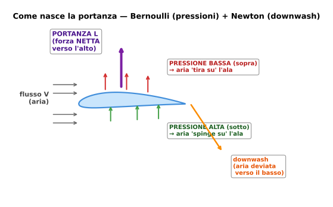
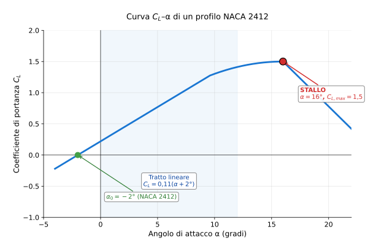

# Lezione 2 — Portanza

> **Obiettivo**: alla fine di questa lezione sai spiegare *perché* un'ala genera portanza, leggere la formula $L = \frac{1}{2}\rho V^2 S C_L$ termine per termine, e prevedere come cambia la portanza quando cambi velocità, quota o angolo di attacco.

---

## 🎯 In una riga

La **portanza** è la forza **perpendicolare alla velocità**, diretta verso l'alto, che sostiene il velivolo in aria. Nasce dall'interazione tra il profilo alare e il flusso d'aria che lo investe.

---

## ✈️ A cosa serve davvero

Senza portanza, **non voli**. È la forza che pareggia il peso e tiene l'aereo in aria. Ogni volta che senti parlare di "stallo", "decollo", "velocità minima", "carico alare" — stai parlando di portanza.

In **volo livellato e rettilineo**, l'equazione fondamentale è una sola:

$$L = W$$

cioè *la portanza eguaglia il peso*. Da qui parte tutto: se il pilota vuole salire, deve aumentare la portanza; se l'aereo è più carico, serve più portanza per restare in aria; se la quota cambia, la portanza disponibile cambia.

---

## 📐 Come nasce la portanza — due viste, una sola fisica

C'è un mito da sfatare: **NON è vero** che "l'aria sopra deve percorrere più strada nello stesso tempo, quindi va più veloce". È falso storicamente e fisicamente. La portanza ha due spiegazioni complementari, entrambe corrette:

### Vista 1 — Pressione (Bernoulli)
Il profilo, per la sua **forma curva** e per l'**angolo di attacco**, costringe l'aria sopra ad accelerare e quella sotto a rallentare. Velocità maggiore sopra → **pressione minore sopra**. La differenza di pressione tra ventre e dorso, integrata su tutta la superficie alare, dà una forza netta diretta verso l'alto: la portanza.

### Vista 2 — Reazione (Newton)
L'ala devia un'enorme massa d'aria verso il **basso** (il cosiddetto *downwash*). Per il principio di azione-reazione, l'aria spinge l'ala verso l'**alto**. Più aria deviata + più velocità di deviazione = più portanza.

> 💡 Non sono due cose diverse: sono **due descrizioni dello stesso fenomeno**. Bernoulli ti dà *dove* nasce la forza (sulla superficie), Newton ti dice *quanta massa d'aria* hai mosso. In compito basta saper citare correttamente entrambe.

---

## 🔢 La formula della portanza — la conoscerai a memoria

$$L = \frac{1}{2} \rho V^2 S C_L$$

| Simbolo | Significato | Unità SI | Tipico (Cessna 172 in crociera) |
|---|---|---|---|
| $L$ | Portanza | N | ~10 200 N (= peso) |
| $\rho$ | Densità dell'aria | kg/m³ | 1,225 al livello mare |
| $V$ | Velocità rispetto all'aria | m/s | ~63 m/s (122 kt) |
| $S$ | Superficie alare | m² | 16,2 |
| $C_L$ | Coefficiente di portanza | adimensionale | ~0,26 |

> ⚠️ **Errore numero uno**: dimenticare il fattore **½** quando scrivi la formula a memoria. Non perdonarti questo errore.

### Come pensare alla formula
Ogni termine ha un significato fisico — non è solo algebra:

- **$\frac{1}{2}\rho V^2$** = pressione dinamica $q$. È la "forza per unità di superficie" che il vento esercita su qualsiasi cosa che attraversa.
- **$S$** = quanta ala hai. Più ala intercetta l'aria, più portanza generi.
- **$C_L$** = quanto sei *bravo* a trasformare quella pressione in portanza. Dipende dal profilo, dall'angolo di attacco, dai flap.

In una riga: $L = q \cdot S \cdot C_L$ → "pressione dinamica × superficie × bravura".

---

## 📈 Cosa cambia se cambi qualcosa

| Se aumenti… | …la portanza | Perché |
|---|---|---|
| **Velocità** ($V$) | cresce con il **quadrato** | $V^2$ nella formula. Raddoppi V → 4× la portanza |
| **Densità** ($\rho$) | cresce linearmente | A quota più alta $\rho$ scende → meno portanza a parità di V |
| **Superficie alare** ($S$) | cresce linearmente | Ali più grandi = più portanza (ma più peso e resistenza) |
| **Angolo di attacco** ($\alpha$) | cresce $C_L$ → cresce $L$ | Fino allo stallo: oltre, $C_L$ crolla |

### La curva $C_L$–$\alpha$

- **Tratto lineare** (~0° a ~12°): $C_L$ cresce proporzionalmente ad $\alpha$. Il pilota tira la cloche → muso su → $\alpha$ sale → $C_L$ sale → portanza sale.
- **Curvatura finale** (~12° a 16°): il flusso sul dorso comincia a separarsi.
- **Stallo** (oltre $\alpha_{critico}$): il flusso si stacca completamente, $C_L$ **crolla bruscamente**. L'aereo non vola più. È uno dei punti più importanti di tutto il programma.

> 🎯 **Memorizza**: $\alpha_{stallo} \approx 15°$–$18°$ per profili tipici. Non è la velocità a far stallare l'aereo — è l'**angolo di attacco** troppo alto.

---

## ⚖️ Equilibrio in volo livellato

Quando l'aereo vola dritto e a quota costante, le quattro forze sono in equilibrio:

$$L = W \qquad T = D$$

**Cosa significa per gli esercizi**: ogni volta che il problema dice "*velivolo in crociera livellata*" o "*volo orizzontale costante*", **scrivi subito** $L = W = mg$. È il primo passo, sempre.

---

## ✈️ Esempi concreti su velivoli reali

### Cessna 172 in crociera — il velivolo "scuola"
- Massa: 1043 kg → $W = 1043 \cdot 9{,}81 \approx 10\,232$ N
- Velocità: 122 kt = 62,76 m/s
- Quota: livello mare → $\rho = 1{,}225$ kg/m³
- $S = 16{,}2$ m²

$L = W$ → $C_L = \dfrac{2W}{\rho V^2 S} = \dfrac{2 \cdot 10232}{1{,}225 \cdot 62{,}76^2 \cdot 16{,}2} \approx 0{,}26$

→ valore tipico per aviazione generale in crociera (vedi formulario: 0,2–0,4 ✅).

### Boeing 737 in crociera ad alta quota
- Massa: ~70 000 kg → $W \approx 686\,700$ N
- Velocità: 450 kt = 231 m/s
- Quota: 10 000 m → $\rho = 0{,}413$ kg/m³ (tabella ISA)
- $S = 124$ m²

$C_L = \dfrac{2 \cdot 686700}{0{,}413 \cdot 231^2 \cdot 124} \approx 0{,}50$

→ tipico per liner in crociera (0,4–0,6 ✅). Nota: a parità di superficie, il jet ha bisogno di velocità altissime per compensare la bassa densità in quota.

### Eurofighter — l'altro estremo
Caccia da combattimento, $S \approx 50$ m², massa ~16 000 kg, velocità di crociera supersonica ~1600 km/h = 444 m/s a 11 km. Il $C_L$ richiesto è bassissimo (~0,1) perché la pressione dinamica $\frac{1}{2}\rho V^2$ è enorme — il caccia compensa con velocità, non con coefficiente.

---

## 🎯 Box "Da ricordare per l'interrogazione"

> 1. **$L = \frac{1}{2}\rho V^2 S C_L$** — il fattore ½ NON si dimentica.
> 2. La portanza è **perpendicolare alla velocità**, non "verso l'alto" in senso assoluto (in virata l'ala sostiene il peso *e* fa girare il velivolo).
> 3. In **volo livellato**, $L = W = mg$. È la prima cosa che scrivi negli esercizi.
> 4. La portanza cresce con il **quadrato della velocità**: raddoppi V, quadruplichi $L$.
> 5. Lo **stallo** dipende dall'**angolo di attacco**, non dalla velocità (anche se a velocità più bassa serve $\alpha$ maggiore).
> 6. **Bernoulli + Newton** spiegano la stessa portanza da due angolazioni complementari.

---

## ⚠️ Errori comuni

❌ **Dimenticare il ½** nella formula. È l'errore più frequente quando si copia da memoria. Riscrivila ogni volta dall'inizio.

❌ **Confondere massa e peso**. La formula $L = W$ richiede il peso in newton, NON la massa in kg. Sempre $W = m \cdot g$ prima.

❌ **Pensare che la portanza vada sempre verso l'alto**. La portanza è perpendicolare alla velocità. In una virata inclinata, parte della portanza tira lateralmente per curvare; per questo in virata serve **più** portanza totale per non perdere quota.

❌ **Usare $\rho_0 = 1{,}225$ a qualsiasi quota**. La densità scende con l'altitudine. A 10 000 m è circa **un terzo** di quella al suolo. Usa la tabella ISA del [formulario](../00-formulario/formulario.md#7-atmosfera-standard-isa--valori-chiave).

❌ **Pensare che lo stallo arrivi a "una certa velocità fissa"**. La velocità di stallo cambia con peso, quota, configurazione (flap). La grandezza fisica fondamentale è l'**angolo di attacco critico**.

❌ **Non convertire la velocità in m/s prima di sostituire**. Se il problema dà 120 kt, devi convertirli (× 0,5144 = 61,7 m/s) prima di mettere $V$ nella formula. Mai sostituire kt grezzi.

---

## 🧠 Domande di autoverifica

1. Se un Cessna 172 raddoppia la sua velocità di crociera, di quanto aumenta la portanza (a parità di $C_L$ e quota)?
2. Perché un aereo di linea ha bisogno dei flap per atterrare?
3. Un velivolo passa dal livello mare a 5 000 m mantenendo la stessa velocità e angolo di attacco. La sua portanza aumenta, diminuisce o resta uguale? Di quanto, circa?
4. In volo livellato un Boeing 737 di 70 t a 10 000 m a 450 kt: scrivi l'equazione di equilibrio e dimmi quale incognita ti serve per trovare $C_L$.
5. Lo stallo dipende dalla velocità o dall'angolo di attacco? E perché allora il manuale di volo dà una "velocità di stallo" specifica?

👉 Risposte

1. La portanza **quadruplica** ($\times 4$). Dipende da $V^2$: $V \to 2V$ implica $V^2 \to 4V^2$, quindi $L \to 4L$.

2. Per atterrare a velocità bassa, il velivolo ha bisogno di un $C_{L,max}$ alto. I **flap aumentano la curvatura del profilo** e (alcuni tipi) anche la superficie alare effettiva → $C_L$ in approccio sale a 1,5–2,2 invece dei 1,2–1,5 dell'ala "pulita". Senza flap dovrebbe atterrare molto più veloce, oltre i limiti strutturali e di pista.

3. **Diminuisce** di circa **40%**. A 5000 m $\rho \approx 0{,}736$ kg/m³ (tabella ISA), contro 1,225 al livello mare. Rapporto $\sigma = 0{,}736/1{,}225 \approx 0{,}60$ → la portanza diventa il 60% di quella iniziale, cioè perde circa il 40%. Per recuperarla, il pilota deve aumentare $\alpha$ (più $C_L$) o accelerare.

4. Equazione: $L = W = m \cdot g = 70000 \cdot 9{,}81 \approx 686700$ N. Per trovare $C_L$ ti serve **sapere $\rho$** (in quota: 0,413 kg/m³ a 10 km) e **convertire 450 kt in m/s** (× 0,5144 = 231 m/s). Poi $C_L = \dfrac{2W}{\rho V^2 S}$.

5. Dipende **dall'angolo di attacco**. Il manuale dà la "velocità di stallo" perché in **volo livellato** a un certo peso, quella velocità corrisponde all'$\alpha$ critico: $V_S = \sqrt{\dfrac{2W}{\rho S C_{L,max}}}$. Cambia il peso o la quota, e $V_S$ cambia di conseguenza — ma l'$\alpha$ critico rimane lo stesso.

---

## ➡️ Prossimo passo

Vai a [Lezione 3 — Resistenza aerodinamica](./03-resistenza.md) per scoprire il prezzo che paghi per generare portanza.

Oppure, **se vuoi vedere la formula della portanza in azione subito**, lavora su [Esercizio 1 — Coefficiente di portanza in crociera (Cessna 172)](../03-esercizi/01-base-portanza-cessna.md). I dati della sezione "Esempi" qui sopra ti torneranno utili passo per passo.
