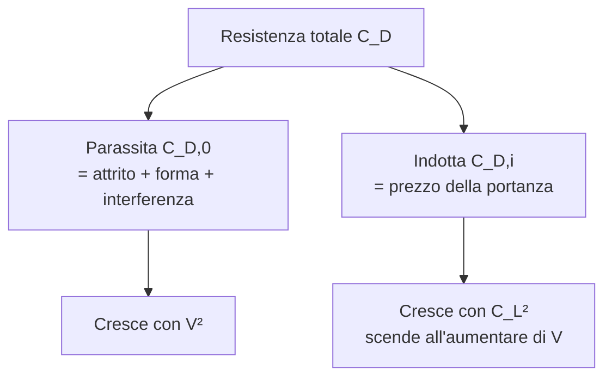

# Lezione 3 — Resistenza aerodinamica

> **Obiettivo**: alla fine di questa lezione sai distinguere resistenza parassita e indotta, leggere la formula $D = \frac{1}{2}\rho V^2 S C_D$, capire perché la velocità di minima resistenza esiste e perché un aliante ha le ali lunghe e sottili.

---

## 🎯 In una riga

La **resistenza aerodinamica** è la forza **parallela alla velocità**, diretta contro il moto, che il velivolo deve continuamente vincere bruciando carburante (o accettando di scendere, in planata).

---

## ✈️ A cosa serve davvero

Se la portanza è la forza che ti tiene in aria, la resistenza è il **prezzo che paghi** per starci. Volare è un gioco di equilibrio tra le due:

- **Più resistenza → più spinta serve → più carburante → meno autonomia**
- **Meno resistenza → si vola più lontano con la stessa benzina** (un aliante porta questo concetto all'estremo)

In **volo livellato a velocità costante**, la spinta del motore eguaglia esattamente la resistenza:

$$T = D$$

Capire la resistenza significa capire perché un Boeing 737 consuma meno per passeggero di un Cessna 172, perché gli alianti hanno quella forma stranissima, e perché un caccia con post-bruciatore beve cherosene a litri al secondo.

---

## 📐 La formula della resistenza — quasi un fotocopia della portanza

$$D = \frac{1}{2} \rho V^2 S C_D$$

| Simbolo | Significato | Unità SI |
|---|---|---|
| $D$ | Resistenza (Drag) | N |
| $\rho$ | Densità dell'aria | kg/m³ |
| $V$ | Velocità rispetto all'aria | m/s |
| $S$ | Superficie alare di riferimento | m² |
| $C_D$ | Coefficiente di resistenza totale | adimensionale |

**Identica alla portanza**, ma con $C_D$ al posto di $C_L$. Tutta la fisica di un velivolo è nascosta nel rapporto $C_L/C_D$, che chiamiamo **efficienza** (la vediamo nella prossima lezione).

> ⚠️ **Attenzione**: $C_D$ NON è una proprietà fissa del velivolo. Varia con velocità, angolo di attacco, configurazione (flap dentro/fuori), quota, sporco sull'ala. Nei problemi base si usa un valore "tipico" da tabella.

---

## 🧩 Resistenza parassita + resistenza indotta

La resistenza totale $C_D$ è **somma di due contributi distinti**:

$$C_D = C_{D,0} + C_{D,i}$$



### 1. Resistenza parassita ($C_{D,0}$) — c'è anche se non porti
Tutto quello che genera resistenza **anche senza generare portanza**. Cause:

- **Attrito viscoso** (skin friction): l'aria "graffia" la superficie del velivolo. Dipende da quanto è bagnata l'ala (superficie totale a contatto col flusso) e dal **numero di Reynolds**.
- **Resistenza di forma** (pressure drag): scia turbolenta dietro le parti tozze (carrelli fuori, antenne, supporti motore).
- **Resistenza di interferenza**: dove due parti del velivolo si incontrano (ala-fusoliera), i flussi si disturbano e si crea resistenza extra.

**Tipico**: $C_{D,0} \approx 0{,}020$–$0{,}030$ per aerei moderni puliti; $\approx 0{,}015$ per alianti; $\approx 0{,}005$ per profili NACA serie 6 isolati (un'ala da sola, senza fusoliera).

### 2. Resistenza indotta ($C_{D,i}$) — il prezzo della portanza
Nasce dal **fatto stesso di generare portanza**. Quando l'ala "spinge giù" l'aria per portarti su, all'estremità alare l'aria sotto (alta pressione) cerca di passare sopra (bassa pressione), creando i famosi **vortici di estremità**. Questi vortici si portano via energia → resistenza extra.

$$C_{D,i} = \frac{C_L^2}{\pi \cdot \lambda \cdot e}$$

| Simbolo | Significato | Unità |
|---|---|---|
| $C_L$ | Coefficiente di portanza | adimensionale |
| $\lambda$ | Allungamento alare = $b^2/S$ | adimensionale |
| $b$ | Apertura alare | m |
| $e$ | Fattore di Oswald (efficienza distribuzione portanza) | 0,7–0,9 tipico |

**Letture chiave**:

- $C_{D,i}$ cresce col **quadrato di $C_L$**: a bassa velocità (alti $C_L$ per sostenersi) la resistenza indotta esplode → atterraggio è la fase a indotta dominante
- $C_{D,i}$ scende con l'**allungamento alare** $\lambda$: ali lunghe e strette → meno indotta. **Per questo gli alianti hanno quelle ali**.
- I **winglet** (alette verticali al tip) ostacolano i vortici, aumentano l'$e$ effettivo, riducono l'indotta — risparmio carburante 3–5% per i jet di linea.

---

## 📈 La polare di resistenza — il grafico più importante

Mettendo insieme parassita e indotta, la **polare** del velivolo è:

$$C_D = C_{D,0} + \frac{C_L^2}{\pi \lambda e}$$

```
   C_D
    │      ╱── totale (somma)
    │   ╱╱
    │ ╱╱
    │╱╱        ┌── indotta (cresce con C_L²)
    │╱      ╱──
    │     ╱
────┼──── ───────── parassita C_D,0 (costante)
    │
    └────────────────── C_L
       0    0,5   1,0
```

A **basso $C_L$** (alta velocità): parassita domina, indotta trascurabile.
Ad **alto $C_L$** (bassa velocità, atterraggio): indotta esplode, parassita poco rilevante.
**Nel mezzo**: punto di minima resistenza totale → la velocità più "economica" del velivolo.

---

## ⚡ Velocità di minima resistenza — il punto magico

Esiste una velocità a cui la resistenza totale è minima. Si trova quando **resistenza parassita = resistenza indotta** (lo dimostra la matematica derivando $C_D$ rispetto a $C_L$, ma per il liceo basta sapere il risultato):

$$C_L^* = \sqrt{\pi \lambda e \cdot C_{D,0}}$$

A questa velocità il velivolo è **al massimo dell'efficienza** $E = C_L/C_D$. È la velocità che usano gli alianti per planare il più lontano possibile, e quella usata dai jet di linea per la massima autonomia in crociera.

---

## ✈️ Esempi su velivoli reali

### Cessna 172 in crociera al livello mare
- $W = 10\,232$ N (peso del nostro Cessna noto)
- $V = 122$ kt = 62,76 m/s
- $S = 16{,}2$ m²
- $C_L \approx 0{,}26$ (calcolato in [Esercizio 1](../03-esercizi/01-base-portanza-cessna.md))
- $\lambda = b^2/S = 11^2/16{,}2 \approx 7{,}5$
- $C_{D,0} \approx 0{,}028$, $e \approx 0{,}8$

Calcolo della **resistenza indotta**:
$$C_{D,i} = \frac{0{,}26^2}{\pi \cdot 7{,}5 \cdot 0{,}8} = \frac{0{,}0676}{18{,}85} \approx 0{,}0036$$

Resistenza **totale**:
$$C_D = 0{,}028 + 0{,}0036 \approx 0{,}032$$

In crociera, **parassita pesa ~88%, indotta ~12%**. Per il Cessna in crociera la priorità è ridurre la parassita (lavabile fenicotteri), non l'indotta.

### Aliante ASK-21 — altro mondo
- $\lambda \approx 23$ (apertura 17 m, corda media 0,75 m)
- $C_{D,0} \approx 0{,}015$ (estremamente pulito, niente carrello, niente eliche)
- $e \approx 0{,}9$

A un $C_L$ tipico di crociera 0,8 (bassa velocità, planata):
$$C_{D,i} = \frac{0{,}8^2}{\pi \cdot 23 \cdot 0{,}9} = \frac{0{,}64}{65} \approx 0{,}0098$$

$C_D \approx 0{,}025$. **Efficienza** $E = C_L/C_D = 0{,}8/0{,}025 = 32$. Questo aliante può percorrere 32 metri in avanti per ogni metro di quota persa. Un Cessna ne fa 10.

### Boeing 737 in crociera ad alta quota
$\lambda \approx 9$, $C_{D,0} \approx 0{,}025$, $C_L \approx 0{,}5$.
$C_{D,i} = 0{,}5^2/(\pi \cdot 9 \cdot 0{,}85) = 0{,}010$
$C_D = 0{,}025 + 0{,}010 = 0{,}035$. **Indotta pesa ~28%** in crociera — molto più del Cessna, perché vola con $C_L$ doppio. I winglet del 737 NG/MAX sono lì per questo motivo.

---

## 🎯 Box "Da ricordare per l'interrogazione"

> 1. **$D = \frac{1}{2}\rho V^2 S C_D$** — stessa struttura della portanza, con $C_D$.
> 2. **$C_D = C_{D,0} + C_{D,i}$** — parassita (esiste sempre) + indotta (prezzo della portanza).
> 3. **$C_{D,i} = C_L^2/(\pi \lambda e)$** — l'indotta cresce col quadrato di $C_L$ e scende con l'allungamento.
> 4. A **bassa velocità** domina l'indotta; ad **alta velocità** domina la parassita.
> 5. **Velocità di minima resistenza** = velocità di **massima efficienza** = punto in cui parassita ≈ indotta.
> 6. **Alianti** = $\lambda$ enorme (20–30) → indotta minima → efficienze 30–60.
> 7. **Winglet** = barriera ai vortici di estremità → meno indotta → meno carburante.

---

## ⚠️ Errori comuni

❌ **Confondere $D$ con $C_D$**. $D$ è una forza in newton; $C_D$ è un numero puro. Non scrivere mai "$D = 0{,}03$" — è $C_D$ a quel valore.

❌ **Pensare che la resistenza dipenda solo dalla forma**. La forma conta per la parassita, ma l'indotta dipende dall'angolo di attacco e dall'allungamento. Un'ala simmetrica e un'ala curva, a parità di $C_L$ generato, producono **la stessa resistenza indotta**.

❌ **Dimenticare che $C_{D,i}$ scende con $\lambda$**. Allungamento doppio = indotta dimezzata, a parità di $C_L$. Vale la pena ricordarlo per spiegare le proporzioni di un aliante.

❌ **Trascurare l'indotta in atterraggio**. A flap pieni e velocità di approccio, $C_L \approx 2$, l'indotta è enorme. È una delle ragioni per cui un aereo "scende ripido" con flap pieni.

❌ **Confondere "efficienza" con "velocità massima"**. La velocità di massima efficienza è di solito **ben più bassa** della velocità massima del velivolo. Un Cessna 172 ha $V_{max} \approx 160$ kt ma vola al meglio ~70 kt.

❌ **Pensare che il fattore di Oswald $e$ sia sempre 1**. Solo per un'ala con distribuzione di portanza ellittica perfetta (caso ideale, mai realizzato). Nei calcoli reali $e \in [0{,}7;\, 0{,}9]$.

---

## 🧠 Domande di autoverifica

1. Un aliante ASK-21 ($\lambda = 23$) e un caccia Eurofighter ($\lambda \approx 2{,}2$) hanno la stessa $C_L = 0{,}8$. Quale dei due ha più resistenza indotta? Di quanto, approssimativamente (rapporto)?
2. In crociera ad alta velocità, cosa pesa di più: parassita o indotta?
3. Come si chiamano i dispositivi installati alle estremità delle ali dei jet moderni per ridurre la resistenza indotta?
4. Perché un aliante ha le ali lunghe e sottili?
5. Un Cessna 172 in crociera (dati di [Esercizio 1](../03-esercizi/01-base-portanza-cessna.md)) ha efficienza $E \approx 8$. Calcola la **resistenza** $D$ e poi la **spinta** $T$ richiesta al motore in crociera livellata.

<details markdown="1">
<summary>👉 Risposte</summary>

1. **Il caccia ha molto più indotta**. Rapporto $C_{D,i}^{caccia}/C_{D,i}^{aliante} = \lambda^{aliante}/\lambda^{caccia} = 23/2{,}2 \approx 10{,}5$ (a parità di $e$). Il caccia paga ~10 volte più in resistenza indotta. È uno dei motivi per cui i caccia sono affamati di carburante: hanno ali piccole per la velocità, ma a bassa V con $C_L$ alto pagano un conto enorme di indotta.

2. **Parassita** domina ad alta velocità. La parassita cresce con $V^2$, l'indotta scende perché $C_L$ è basso (a velocità alta non serve molto $C_L$ per portare il peso). In crociera di un jet, la parassita è ~70-80% del totale; l'indotta ~20-30%.

3. **Winglet** (italiano: alette di estremità). Ostacolano la migrazione del flusso dal ventre al dorso al tip, riducendo la forza dei vortici. Possono ridurre la resistenza indotta del 15-20%, traducendosi in 3-5% di risparmio carburante. Esistono varianti: blended winglet (737 NG), split scimitar (737 MAX), raked tip (787), shark fin (A320neo).

4. Per **avere allungamento alare $\lambda$ enorme** (20–30) e quindi resistenza indotta minima. La formula $C_{D,i} = C_L^2/(\pi \lambda e)$ dice che l'indotta è inversamente proporzionale a $\lambda$: raddoppi $\lambda$, dimezzi l'indotta. Per un aliante che vola lentamente (alto $C_L$, indotta dominante), questa è la chiave per ottenere efficienze 40+.

5. **Resistenza**: $E = L/D \Rightarrow D = L/E = W/E$ (in volo livellato $L = W$).
   $D = 10\,232 / 8 = 1\,279$ N.
   In crociera livellata $T = D$, quindi il motore deve erogare **~1280 N di spinta** continua. Questa è la spinta che il motore Lycoming O-320 del Cessna 172 fornisce a regime di crociera.

</details>

---

## ➡️ Prossimo passo

Vai a [Lezione 4 — Efficienza aerodinamica e polare](./04-efficienza.md) per capire come parassita e indotta si combinano nel parametro più importante del progetto aeronautico.

Oppure prova [Esercizio 3 — Resistenza in crociera (ATR 72)](../03-esercizi/03-base-resistenza-atr.md) 🚧 (ti consigliamo di chiederlo a Claude nel Project se non è ancora pronto).
