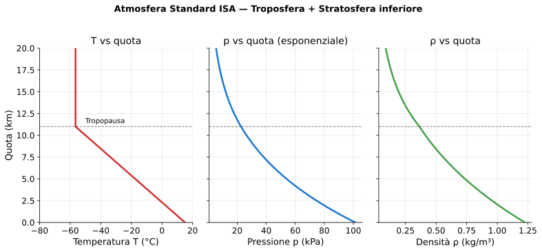

# Lezione 5 — Atmosfera Standard ISA

> **Obiettivo**: alla fine di questa lezione sai cos'è l'atmosfera ISA, quali sono i valori al livello del mare, come T, p e ρ cambiano con la quota, e perché per ogni esercizio in quota DEVI usare la tabella ISA — mai $\rho_0$.

---

## 🎯 In una riga

L'**Atmosfera Standard Internazionale** (ISA) è un **modello matematico convenzionale** dell'atmosfera, accordato a livello mondiale, che ti dà temperatura, pressione e densità a ogni quota. Serve perché l'atmosfera reale cambia ogni giorno: per progettare velivoli e fare esercizi standard ne serve una "ufficiale" e fissa.

---

## ✈️ A cosa serve davvero

Ogni formula che hai visto fin qui ha una $\rho$ dentro:

- $P = \frac{1}{2}\rho V^2 S C_p$
- $R = \frac{1}{2}\rho V^2 S C_R$
- $V_S = \sqrt{2W/(\rho S C_{p,max})}$
- $Re = \rho V c / \mu$

**Se $\rho$ cambia, cambia tutto**. E $\rho$ cambia con la quota: a 10 000 m è circa **un terzo** del valore al livello mare. Questo significa che un velivolo:

- A 10 000 m **stalla a velocità maggiore** di quella che stalla al suolo
- Ha **meno portanza** a parità di velocità
- Ha **meno resistenza** a parità di velocità (sì, c'è un lato positivo!)
- Consuma **meno carburante** in crociera (parassita scende con $\rho$)

Per questo motivo i jet di linea volano alti (8 000–12 000 m): risparmiano carburante. Ma per *salire* a quota ci vuole tempo e energia, quindi conviene solo per voli lunghi.

---

## 📐 I 4 valori da imparare a memoria — livello del mare ISA

| Grandezza | Simbolo | Valore al livello mare ISA | Note |
|---|---|---|---|
| Temperatura | $T_0$ | **15 °C = 288,15 K** | Sempre in K nei calcoli |
| Pressione | $p_0$ | **101 325 Pa** ≈ 1013 hPa | 1 atm standard |
| Densità | $\rho_0$ | **1,225 kg/m³** | Il valore più importante per noi |
| Accelerazione gravità | $g$ | **9,81 m/s²** | Costante per la troposfera |

> ⚠️ **Conversione T**: nei calcoli di gas (equazione di stato), la temperatura va sempre in **kelvin**. $T(K) = T(°C) + 273{,}15$. Mai sostituire °C nelle formule.

---

## 🌡️ La struttura dell'atmosfera in altezza — quello che davvero ti serve

I tre grafici mostrano come **temperatura, pressione e densità** cambiano con la quota. La linea tratteggiata orizzontale a 11 km segna la **tropopausa**: sopra, la temperatura resta costante a −56,5 °C (stratosfera inferiore). Pressione e densità invece continuano a scendere esponenzialmente.

Per il liceo ti basta sapere **due strati**:

### 1. Troposfera (0 – 11 000 m)
- È dove vola il 99% del traffico aereo civile
- **Temperatura diminuisce linearmente**: $T(h) = T_0 - 0{,}0065 \cdot h$ (h in metri, T in °C o K — la differenza è la stessa)
- Il gradiente $-6{,}5\,°\text{C}/1000\,\text{m}$ è da memorizzare

### 2. Tropopausa e stratosfera inferiore (11 000 – 20 000 m)
- **Temperatura costante** a $-56{,}5\,°\text{C} \approx 216{,}65$ K
- Pressione e densità continuano a scendere (esponenzialmente)

---

## 🔢 Le formule del liceo per la troposfera

### Temperatura
$$T(h) = T_0 - 0{,}0065 \cdot h$$
con $h$ in metri, $T_0 = 288{,}15$ K (= 15 °C).

### Densità — la formula che userai negli esercizi
$$\rho(h) = \rho_0 \cdot \left(\frac{T(h)}{T_0}\right)^{4{,}256}$$

L'esponente 4,256 deriva da $g/(R \cdot \alpha) - 1$ dove $\alpha = 0{,}0065$ K/m e $R = 287$ J/(kg·K) per aria secca. **Non serve dimostrarla** — basta saperla applicare.

### Densità relativa
$$\sigma = \frac{\rho(h)}{\rho_0}$$

→ a 5000 m, $\sigma \approx 0{,}60$ (la densità è il 60% di quella al suolo).

> 💡 **Trucco da liceo**: per evitare il calcolo della formula esponenziale negli esercizi, **usa direttamente la tabella ISA** del [formulario](../00-formulario/formulario.md#7-atmosfera-standard-isa--valori-chiave). La formula è lì in caso ti chiedano un valore intermedio.

---

## 📊 Tabella ISA — i valori che ti chiederanno

Ricopio i valori più usati negli esercizi (vedi formulario per la versione completa):

| Quota $h$ | $T$ (°C) | $p$ (Pa) | $\rho$ (kg/m³) | $\sigma$ |
|---|---|---|---|---|
| **0 m (mare)** | 15,0 | 101 325 | **1,225** | 1,000 |
| 1 000 m | 8,5 | 89 875 | 1,112 | 0,907 |
| 2 000 m | 2,0 | 79 495 | 1,007 | 0,822 |
| **3 000 m** | −4,5 | 70 109 | **0,909** | 0,742 |
| **5 000 m** | −17,5 | 54 020 | **0,736** | 0,601 |
| 8 000 m | −37,0 | 35 600 | 0,526 | 0,429 |
| **10 000 m** | −50,0 | 26 436 | **0,413** | 0,338 |
| **11 000 m (tropopausa)** | −56,5 | 22 632 | 0,365 | 0,297 |

**Le quote in grassetto** sono quelle ricorrenti negli esercizi — vale la pena memorizzare $\rho$ per livello mare, 3000 m, 5000 m, 10 000 m.

---

## ✈️ Esempi concreti

### Cessna 172 in crociera a 3000 m (10 000 ft)
- $\rho(3000) = 0{,}909$ kg/m³ (tabella)
- $T(3000) = -4{,}5\,°\text{C}$ → fa freschetto, anche d'estate

A parità di velocità e $C_p$ del Cessna a livello mare, la portanza scende del fattore $\sigma = 0{,}742$ → del 26%. Per recuperare, il pilota **aumenta l'angolo di attacco** (più $C_p$) o **accelera**.

### Boeing 737 a FL350 (10 670 m)
- $\rho \approx 0{,}38$ kg/m³ (interpolato)
- $T \approx -54{,}3\,°\text{C}$ — fuori cabina è −54°C, dentro 22°C grazie al condizionamento

A questa quota, il 737 vola a Mach 0,78 = ~470 kt. Vola così alto perché:

- Densità bassa → meno resistenza parassita → meno consumo
- Sopra il maltempo (cumulonimbi non superano 12-15 km)
- Aria ferma → meno turbolenza

### Eurofighter ad alta quota (15 000 m, stratosfera)
- $\rho \approx 0{,}195$ kg/m³ (16% del livello mare)
- $T = -56{,}5\,°\text{C}$ (costante in stratosfera)

Per generare la stessa portanza del livello mare, deve volare a velocità **ridotte di un fattore $1/\sqrt{\sigma}$** maggiore — ecco perché i caccia ad alta quota volano supersonici, è quasi una necessità fisica.

---

## 🎯 Box "Da ricordare per l'interrogazione"

> 1. **ISA al livello mare**: $T_0 = 15\,°\text{C} = 288{,}15$ K, $p_0 = 101\,325$ Pa, $\rho_0 = 1{,}225$ kg/m³.
> 2. **Gradiente termico in troposfera**: $-6{,}5\,°\text{C}$ ogni 1000 m. Sopra 11 km, T costante a $-56{,}5\,°\text{C}$.
> 3. **Densità in quota** = sempre da tabella ISA, MAI $\rho_0$. A 10 km, $\rho \approx 0{,}41$ kg/m³ (un terzo).
> 4. **Densità relativa** $\sigma = \rho/\rho_0$. A 5 km è ~0,60. Usa $\sigma$ per stime rapide.
> 5. **Conversione T**: $T(K) = T(°C) + 273{,}15$ — **sempre in kelvin** nelle formule di gas.
> 6. I jet volano alti per **risparmiare carburante** (meno $\rho$ → meno parassita).

---

## ⚠️ Errori comuni

❌ **Usare $\rho_0 = 1{,}225$ in quota**. È **l'errore numero uno** quando si fanno esercizi su voli in alta quota. Sempre tabella ISA.

❌ **Sostituire T in gradi Celsius nelle formule del gas**. Per esempio nella formula $\rho = p/(RT)$, se metti $T = -50$ (in °C) ottieni una densità negativa o assurda. Sempre kelvin.

❌ **Confondere quota geometrica e quota di pressione**. La quota di pressione (usata in aviazione, "FL350") corrisponde alla quota dove l'atmosfera ISA avrebbe quella pressione. Se a Roma la pressione al suolo è 1020 hPa (alto), la quota di pressione locale al suolo è negativa! Per il liceo basta sapere che esiste questa differenza.

❌ **Pensare che T scenda all'infinito con la quota**. No: in stratosfera è costante (−56,5°C) e poi addirittura sale (per via dell'ozono che assorbe UV). Ma per gli esercizi si resta in troposfera nel 99% dei casi.

❌ **Dimenticare che la pressione scende esponenzialmente** (non linearmente come la T). A 5500 m la pressione è la metà di quella al mare. È una conseguenza dell'equilibrio idrostatico — Anderson la chiama "the most useful equation in atmospheric physics".

---

## 🧠 Domande di autoverifica

1. Qual è la temperatura ISA a 4500 m di quota, in °C e in K?
2. Un Cessna 172 vola a 5000 m con la stessa velocità che usava al mare. La sua portanza è il 100%, 60%, 40% o 30% di quella al livello mare (a parità di $C_p$)?
3. Perché un Boeing 737 a FL350 vola circa 80 kt più veloce della sua velocità di crociera al livello mare?
4. La velocità di stallo $V_S$ di un velivolo aumenta o diminuisce con la quota? Di quanto, percentualmente, a 5000 m?
5. Calcola la pressione $p$ a 11 000 m sapendo che $p(0) = 101\,325$ Pa e che la formula barometrica per la troposfera è $p(h) = p_0 \cdot (T(h)/T_0)^{5{,}256}$.

👉 Risposte

1. $T(4500) = 15 - 0{,}0065 \cdot 4500 = 15 - 29{,}25 = -14{,}25\,°\text{C}$. In kelvin: $-14{,}25 + 273{,}15 = 258{,}9$ K.

2. **60%**. A 5000 m, $\sigma = 0{,}601$. Portanza scende dello stesso fattore di $\rho$, quindi è il **60%** di quella al mare. Il pilota deve compensare alzando $\alpha$ (più $C_p$) o accelerando.

3. La portanza richiesta è la stessa (peso non cambia). Con $\rho$ ridotta di un fattore $\sigma \approx 0{,}30$ a FL350, per mantenere $P = Q$ occorre **velocità maggiore**: $V_{quota} = V_{mare}/\sqrt{\sigma}$. Il fattore $1/\sqrt{0{,}30} \approx 1{,}83$ → la velocità "vera" deve essere ~83% maggiore. (In realtà i piloti lavorano in *velocità indicata IAS*, che si riferisce alla pressione dinamica $\frac{1}{2}\rho V^2$ — la IAS resta uguale, è la *true airspeed TAS* che cresce.)

4. **Aumenta**. $V_S = \sqrt{2W/(\rho S C_{p,max})}$. Se $\rho$ diminuisce, $V_S$ aumenta. A 5000 m con $\sigma = 0{,}601$: $V_{S,5000} = V_{S,mare}/\sqrt{0{,}601} \approx 1{,}29 \cdot V_{S,mare}$. Quindi $V_S$ a 5000 m è circa **+29%** rispetto al mare. Per questo i decolli/atterraggi in alta quota (aeroporti come La Paz, El Alto, 4000 m) richiedono piste lunghissime.

5. $T(11000) = 15 - 0{,}0065 \cdot 11000 = -56{,}5\,°\text{C} = 216{,}65$ K. $T_0 = 288{,}15$ K. Rapporto $T/T_0 = 0{,}7519$. $p = 101325 \cdot 0{,}7519^{5{,}256}$. Calcoliamo $0{,}7519^{5{,}256}$: $\ln(0{,}7519) = -0{,}2851$; $-0{,}2851 \cdot 5{,}256 = -1{,}498$; $e^{-1{,}498} \approx 0{,}2236$. Quindi $p \approx 101325 \cdot 0{,}2236 \approx 22\,650$ Pa. Confronta con tabella: **22 632 Pa** ✅ (ottima approssimazione).

---

## ➡️ Prossimo passo

Vai a [Lezione 6 — Numero di Reynolds](./06-numero-reynolds.md) per capire come viscosità, velocità e dimensioni determinano se un flusso è laminare o turbolento.

Oppure prova [Esercizio 5 — Portanza in quota ISA (Boeing 737)](../03-esercizi/05-medio-portanza-quota.md) 🚧 — applica direttamente quanto imparato qui.
