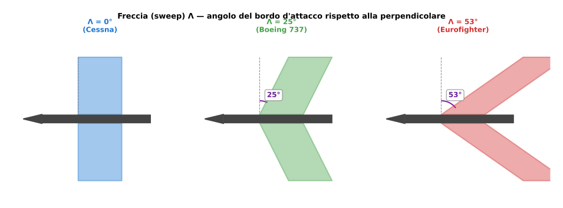
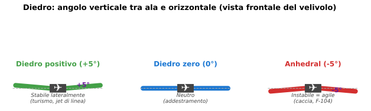

# Lezione 7 — Geometria alare

> **Obiettivo**: alla fine di questa lezione sai cosa sono apertura, superficie alare, allungamento, rastremazione, freccia e diedro, calcolare $\lambda$ per un velivolo dato, e capire perché velivoli con missioni diverse hanno geometrie diverse.

---

## 🎯 In una riga

L'**ala in 3D** non è solo un profilo ripetuto — è una forma con **apertura, rastremazione, freccia e diedro**, scelti dal progettista per bilanciare velocità, manovrabilità, efficienza e stabilità.

---

## ✈️ A cosa serve davvero

Già sai che il **profilo alare** (lezione 1) è la sezione 2D dell'ala. Ma vedendo un Cessna, un caccia e un aliante, ti accorgi che la differenza non è solo nel profilo: è **come quel profilo viene esteso e modellato** lungo l'apertura. È qui che si decide:

- Quanto "vola lontano" (allungamento → efficienza)
- Quanto "vira stretto" (carico alare, allungamento)
- Quanto "tiene la rotta dritta" (diedro → stabilità laterale)
- A che velocità lavora bene (freccia → effetti aerodinamici a Mach alti)

---

## 📐 I 5 parametri geometrici fondamentali

### 1. Apertura alare ($b$)
La distanza tra le due estremità dell'ala (tip a tip), misurata in metri.

| Velivolo | $b$ |
|---|---|
| Cessna 172 | 11 m |
| Piper PA-28 | 11 m |
| ATR 72 | 27 m |
| Boeing 737-800 | 35,8 m |
| Eurofighter | 11 m |
| Aliante ASK-21 | 17 m |

> 💡 Nota curiosa: il Cessna 172 e l'Eurofighter hanno apertura simile, ma il Cessna pesa 1 t e l'Eurofighter 11 t. **Apertura uguale ≠ ali uguali**.

### 2. Superficie alare ($S$)
L'area dell'ala vista dall'alto (proiezione sul piano), misurata in m². Include solo la parte alare; non la coda né il timone.

| Velivolo | $S$ |
|---|---|
| Cessna 172 | 16,2 m² |
| ATR 72 | 61 m² |
| Boeing 737-800 | 124,6 m² |
| Eurofighter | 50 m² |
| Aliante ASK-21 | 17,9 m² |

### 3. Allungamento alare ($\lambda$ — il re dei parametri)
Il rapporto tra apertura al quadrato e superficie:

$$\lambda = \frac{b^2}{S}$$

È un **numero adimensionale** che ti dice "quanto è lunga e stretta" l'ala.

| Velivolo | $\lambda = b^2/S$ |
|---|---|
| Eurofighter | $11^2/50 \approx 2{,}4$ |
| Cessna 172 | $11^2/16{,}2 \approx 7{,}5$ |
| Boeing 737-800 | $35{,}8^2/124{,}6 \approx 10{,}3$ |
| ATR 72 | $27^2/61 \approx 12$ |
| Aliante ASK-21 | $17^2/17{,}9 \approx 16$ |
| Aliante DG-1000 | $20^2/16{,}7 \approx 24$ |

**$\lambda$ è la leva più potente per controllare**:

- Resistenza indotta ($C_{R,i} \propto 1/\lambda$ — vedi Lezione 3)
- Efficienza massima ($E_{max} \propto \sqrt{\lambda}$ — Lezione 4)

> 🎯 **Memo**: caccia $\lambda \approx 2$–$4$, aviazione generale 6–9, jet di linea 8–12, alianti 16–30. Più $\lambda$ → più efficienza, ma più peso strutturale e fragilità → compromessi.

### 4. Rastremazione ($\tau$)
Il rapporto tra corda all'estremità ($c_t$) e corda alla radice ($c_r$):

$$\tau = \frac{c_t}{c_r}$$

Vedi la figura più sotto ([Geometrie alari](#5-freccia-sweep-lambda)) per il confronto visivo tra ala rettangolare ($\tau=1$), trapezoidale ($\tau\approx 0{,}4$) e delta ($\tau \to 0$).

- $\tau = 1$ → ala **rettangolare** (Cessna 172 — facile da costruire ma non ottimale aerodinamicamente)
- $\tau \approx 0{,}3$–$0{,}5$ → ala **trapezoidale** (la più diffusa)
- $\tau = 0$ → ala **triangolare/delta** (Mirage, Concorde — caccia/supersonici)

L'ala **ellittica** ($\tau$ variabile) è la migliore aerodinamicamente: distribuzione di portanza ottimale, $e \approx 1$. Famosa: Spitfire. Ma costosa da produrre.

### 5. Freccia (sweep, $\Lambda$)
L'angolo di "all'indietro" del bordo d'attacco rispetto alla perpendicolare alla fusoliera.

Range tipici: **Λ = 0°** per aviazione generale; **Λ ≈ 25-35°** per jet di linea (swept wing); **Λ ≈ 40-60°** per caccia supersonici.

| Velivolo | Freccia $\Lambda$ |
|---|---|
| Cessna 172 | $0°$ |
| Boeing 737 | $25°$ |
| Eurofighter | $53°$ (delta a freccia) |
| Concorde | $\approx 75°$ (delta) |

**Perché serve la freccia?** Per ritardare gli effetti dell'**onda d'urto** (Mach > 0,7). Una freccia di 30° riduce la velocità "vista" dal profilo lungo la corda → puoi volare più veloce prima di entrare in regime transonico.

### 6. Diedro
L'angolo tra l'ala e il piano orizzontale, **visto frontalmente** (cioè guardando l'aereo dal davanti).

Tipico: **+1° a +7°** per aerei convenzionali (turismo, jet di linea). **Negativo (anhedral)** sui caccia ad alte prestazioni come l'F-104, Harrier, AV-8B.

**Effetto**: quando l'aereo si inclina, l'ala più bassa "vede" più aria → più portanza → tende a riportare l'aereo dritto. Diedro positivo = **stabilità laterale**.

Aerei militari ad alta manovrabilità hanno spesso **anhedral** (diedro negativo) per essere meno stabili e più reattivi.

---

## 🔢 Carico alare — un parametro quasi geometrico

$$W/S = \text{carico alare} \quad [\text{N/m}^2 \text{ o kg/m}^2]$$

Quanto peso ha un'ala per m² di superficie. **Determina la velocità di stallo** e quanto l'aereo "regge" al vento:

| Velivolo | $W/S$ |
|---|---|
| Aliante ASK-21 | $\approx 32$ kg/m² |
| Cessna 172 | $\approx 64$ kg/m² |
| ATR 72 | $\approx 380$ kg/m² |
| Boeing 737 | $\approx 580$ kg/m² |
| Eurofighter | $\approx 320$ kg/m² (basso per agilità) |
| F-104 Starfighter | $\approx 660$ kg/m² (estremo) |

**Carico alare basso** = stalla a velocità basse (sicurezza, atterraggi corti, alianti).
**Carico alare alto** = velocità di stallo alte ma stabilità in turbolenza, velocità massime alte (jet di linea).

---

## ✈️ Geometria di velivoli a confronto

### Cessna 172 — geometria "scuola"
Rettangolare ($\tau = 1$), $\lambda = 7{,}5$, freccia 0°, diedro positivo lieve. **Costruzione semplice, prestazioni medie ma robuste**. Stalla bene, vola tranquillo.

### ATR 72 — turboelica regionale
Rastremata moderata ($\tau \approx 0{,}5$), $\lambda = 12$, freccia 0°, ali alte (montate sopra fusoliera). **$\lambda$ alto** per efficienza in crociera; ali alte per visibilità a terra dei passeggeri e per evitare aspirazione di pietre.

### Boeing 737-800 — jet di linea
Rastremata ($\tau \approx 0{,}3$), $\lambda = 10$, **freccia 25°** (per Mach 0,78), diedro 6°. Compromesso fra efficienza, velocità, stabilità.

### Eurofighter — caccia delta-canard
$\lambda = 2{,}4$ (basso!), freccia 53°, configurazione **delta-canard** con piani anteriori. Bassa $\lambda$ = alta resistenza indotta a bassa V (compensata dalla spinta motori) ma agilità estrema e prestazioni a Mach 2.

### ASK-21 — aliante didattico
$\lambda = 16$, rettangolare nella zona centrale poi rastremata, freccia 0°, diedro 3°. **Tutto progettato per E_max massima**: $\lambda$ enorme, ali pulite, niente trascinamento.

---

## 🎯 Box "Da ricordare per l'interrogazione"

> 1. **$\lambda = b^2/S$** — è la "leva" principale: più $\lambda$, più efficienza, meno indotta. Memorizzare i range tipici: caccia 2-4, GA 6-9, liner 8-12, aliante 16-30.
> 2. **Rastremazione** $\tau = c_t/c_r$: 1 = rettangolare, 0 = delta. Ottimo aerodinamicamente è ellittico ($e \to 1$).
> 3. **Freccia** $\Lambda$ = angolo all'indietro del bordo d'attacco. Serve per Mach alti (supersonico richiede $\Lambda \geq 40°$).
> 4. **Diedro** = angolo verticale dell'ala. Positivo = stabilità laterale; negativo = agilità.
> 5. **Carico alare $W/S$** determina la velocità di stallo: alto $W/S$ = stalla veloce, vola stabile in turbolenza.
> 6. Geometria **consegue dalla missione**: scuola/turismo $\neq$ liner $\neq$ caccia $\neq$ aliante.

---

## ⚠️ Errori comuni

❌ **Confondere apertura e corda**. Apertura ($b$) è la lunghezza tip-a-tip; corda ($c$) è la profondità avanti-indietro. $\lambda = b^2/S$ usa l'apertura. Reynolds $Re$ usa la corda. Non scambiarle.

❌ **Calcolare $\lambda$ come $b/S$ invece di $b^2/S$**. Errore aritmetico classico. Memorizza la formula come "apertura al quadrato fratto superficie".

❌ **Pensare che freccia = velocità**. Un'ala a freccia 25° non rende automaticamente l'aereo supersonico. Serve combinare freccia con motori potenti, profili adatti, struttura adeguata. La freccia da sola **ritarda** gli effetti compressibili, non li elimina.

❌ **Confondere diedro e freccia**. Diedro = angolo verticale (vista frontale). Freccia = angolo orizzontale (vista dall'alto). Un caccia tipo F-104 ha diedro negativo (anhedral) ma freccia molto bassa.

❌ **Sottovalutare il carico alare**. Due aerei con stesso peso ma carico alare diverso si comportano in modo molto diverso: stallano a velocità diverse, virano in modo diverso, sentono la turbolenza in modo diverso. Pilotare un aliante (32 kg/m²) e un Boeing 737 (580 kg/m²) richiede tecniche opposte.

---

## 🧠 Domande di autoverifica

1. Calcola l'allungamento alare di un Airbus A320 (apertura 35,8 m, superficie 122,6 m²).
2. Tra due alianti identici tranne uno con apertura 17 m e l'altro 25 m (a parità di superficie alare): quale ha efficienza massima maggiore? Di che fattore approssimato?
3. Perché un caccia ha allungamento basso e un aliante alto?
4. Una farfalla, secondo la geometria delle sue ali (apertura 10 cm, area 30 cm²), ha allungamento di...?
5. Un Eurofighter atterra a 80 m/s (un valore alto) mentre un Cessna a 25 m/s. Quale ha carico alare maggiore? Perché?

👉 Risposte

1. $\lambda = b^2/S = 35{,}8^2/122{,}6 = 1281{,}6/122{,}6 \approx 10{,}45$. **Allungamento ~10,5**, tipico per liner moderno (l'A320 è ottimizzato per crociera).

2. **L'aliante con $b = 25$ m** ha $E_{max}$ maggiore di un fattore $\sqrt{\lambda_2/\lambda_1} = \sqrt{(25^2)/(17^2)} = 25/17 \approx 1{,}47$. Cioè ~47% in più di efficienza. Per questo i campionati di volo a vela "Open Class" non hanno limiti di apertura — vincono i 25-30 metri.

3. **Caccia** vuole **bassa resistenza ad alta velocità** (parassita domina) e **agilità in manovra** → ali piccole e rigide → allungamento basso (2-4). Inoltre i caccia spesso volano a $Re$ alti dove la parassita conta più dell'indotta.
**Aliante** vuole **massima efficienza in volo lento** (indotta domina) → allungamento alto (16-30). Trade-off: ali fragili, peso strutturale, vincoli di virata.

4. $\lambda = (10)^2/30 = 100/30 \approx 3{,}33$. **Allungamento ~3,3**, simile a un caccia! Ma nel suo regime di Reynolds (laminare, ~$10^4$) le regole aerodinamiche sono diverse: a quel $Re$ l'allungamento alto non aiuta come nei velivoli "macroscopici".

5. **L'Eurofighter** ha carico alare maggiore (320 kg/m² vs 64 kg/m² del Cessna). $V_S = \sqrt{2(W/S)/(\rho C_{p,max})}$: a parità di $C_{p,max}$, $V_S \propto \sqrt{W/S}$. Rapporto: $\sqrt{320/64} = \sqrt{5} \approx 2{,}24$. Quindi $V_S$ Eurofighter $\approx 2{,}24 \times V_S$ Cessna ≈ $2{,}24 \cdot 25 = 56$ m/s. La velocità di approccio è ancora più alta (1,3 × $V_S$ ≈ 73 m/s ≈ 142 kt), coerente con i 80 m/s indicati.

---

## ➡️ Prossimo passo

Vai a [Lezione 8 — Momento e centraggio](./08-momento-centraggio.md) per capire come la posizione del baricentro determina stabilità e controllabilità del velivolo.
