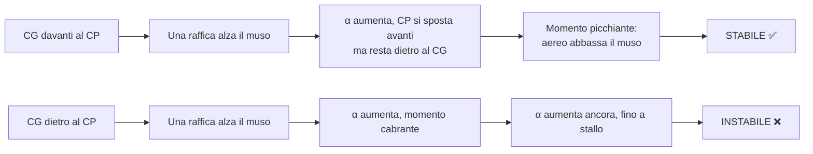

# Lezione 8 — Momento e centraggio

> **Obiettivo**: alla fine di questa lezione sai cosa sono baricentro (CG) e centro di pressione (CP), perché il loro posizionamento determina la stabilità del velivolo, e perché caricare male un piccolo aereo è davvero pericoloso.

---

## 🎯 In una riga

Il **centraggio** è il posizionamento del **baricentro (CG)** del velivolo rispetto al **centro di pressione (CP)** dove agisce la portanza. Da questo dipende **la stabilità** dell'aereo: è la differenza tra un aereo che si "raddrizza da solo" e uno che precipita in stallo non recuperabile.

---

## ✈️ A cosa serve davvero

Fin qui hai trattato l'aereo come un **punto** — una massa che subisce 4 forze. In realtà l'aereo è un **corpo esteso**, e queste forze agiscono in **punti diversi**:

- Il **peso** $W$ agisce nel **baricentro (CG)** = centro di gravità
- La **portanza** $L$ agisce nel **centro di pressione (CP)** dell'ala (più o meno)
- Spinta e resistenza agiscono sui propri assi

Se CG e CP non coincidono, c'è un **braccio** $\Delta x$ tra le due forze → si crea un **momento** (= tendenza a ruotare) intorno al baricentro.

```
                  CP
                  ↑   L (portanza)
                  │
      ───────●────│────────────  fusoliera (vista laterale)
              CG  
              ↓
              W (peso)
              
        ←── Δx ──→
```

**Senza piano di coda orizzontale, l'aereo ruoterebbe** in beccheggio (cabra o picchia). Per evitare disastri, serve la **coda orizzontale (stabilizzatore)**: genera una piccola portanza correttiva che cancella il momento residuo.

---

## 📐 I tre punti chiave da conoscere

### 1. Baricentro (CG = Center of Gravity)
Il **centro di massa** del velivolo. Cambia col carico:

- Più passeggeri davanti → CG più avanti
- Più bagagli dietro → CG più indietro
- Carburante consumato (serbatoi nelle ali) → cambia poco se i serbatoi sono vicini al CG

Nei manuali di volo c'è una **busta di centraggio** (W&B envelope): un grafico che mostra dove può stare il CG per essere "legale".

### 2. Centro di pressione (CP)
Il punto in cui si concentra la **portanza** generata dall'ala. **Si muove con l'angolo di attacco**:

- $\alpha$ basso (alta velocità) → CP più indietro
- $\alpha$ alto (bassa velocità) → CP più avanti
- Allo stallo → CP cambia bruscamente

Per i profili **simmetrici**, il CP coincide col **centro aerodinamico (AC)**, fisso a circa il **25% della corda**.

### 3. Centro aerodinamico (AC)
Il punto dell'ala intorno al quale **il momento è costante** rispetto all'angolo di attacco. **Sempre al ~25% della corda** per profili convenzionali a bassa velocità (subsonico).

> 💡 Per il liceo basta sapere: $AC \approx 1/4$ della corda, dal bordo d'attacco. È un punto di riferimento universale.

---

## ⚖️ Stabilità statica longitudinale — la regola d'oro

L'aereo è **staticamente stabile in beccheggio** se, perturbato (es. una raffica fa alzare il muso), tende a tornare alla condizione iniziale **da solo**.



**Regola**: **CG deve essere davanti al CP** (limite posteriore della busta) per stabilità positiva. Più il CG è avanti, più stabile è l'aereo (ma meno manovriero). Più indietro, più reattivo (e pericoloso).

> 🎯 **Memorizza**: aereo "sicuro" = CG davanti. Aereo "agile" (caccia) = CG arretrato vicino al CP, talvolta intenzionalmente instabile (richiede fly-by-wire computerizzato).

---

## 🪶 Il piano di coda orizzontale — perché esiste

Il piano di coda (stabilizzatore + equilibratore) genera una **piccola portanza, generalmente verso il basso** (deportanza), che bilancia il momento dell'ala principale e mantiene l'equilibrio:

```
              ala principale                    coda
              ↑ L (grande)                       
              │                                   ↓ L_coda (piccola, verso giù)
   ●─────────●────────────────────●──────────────●
   CG     CP_ala                                CP_coda
              ←── braccio ala ──→  ←── braccio coda ──→
   
   Equilibrio momenti: L · braccio_ala = L_coda · braccio_coda
```

**Equilibrio dei momenti** (intorno al CG):
$$L_{ala} \cdot d_{ala} = L_{coda} \cdot d_{coda}$$

Per il liceo non serve calcolarlo numericamente — basta capire che **la coda fa "fattore correttivo"** mantenendo il velivolo livellato.

> ⚠️ **Senza coda funzionante** (es. tail strike che danneggia l'equilibratore), l'aereo perde controllo del beccheggio. Casi famosi: JAL 123 (1985), perdita totale del piano di coda dopo decompressione, schianto.

---

## 📏 Posizione del CG — espressa in % MAC

Nei manuali di volo, la posizione del CG è data in percentuale della **MAC** (Mean Aerodynamic Chord — corda media aerodinamica):

$$\text{CG}_{\%MAC} = \frac{\text{distanza CG dal bordo d'attacco MAC}}{\text{lunghezza MAC}} \times 100$$

### Cessna 172 — busta di centraggio
- **Limite anteriore**: ~$15\%$ MAC (CG molto avanti = aereo lento e stabile)
- **Limite posteriore**: ~$36\%$ MAC (CG arretrato = vicino al limite di stabilità)
- **MAC del Cessna**: ~1,5 m
- **Range CG ammissibile**: ~$0{,}22$ m → solo **22 cm** di tolleranza!

```
                 Centro aerodinamico (25% MAC)
                          │
                          ↓
   ┌─────────────────────────────────────┐
   │         15% ←──── CG ammissibile ────→ 36%
   │         │                              │
   │   ↑ limite anteriore           ↑ limite posteriore
   │   "scuola guida"               "agile"
   └─────────────────────────────────────┘
              0%        25%        50%       100% MAC
```

> 💡 Caricare un Cessna 172 con due adulti pesanti dietro e niente davanti **può portare il CG fuori limite posteriore** — il manuale POH richiede un check W&B prima di ogni volo.

---

## ✈️ Esempi concreti

### Cessna 172 — caricare male per scelta sbagliata
- Pilota 80 kg davanti, copilota vuoto, due passeggeri 90 kg dietro, bagaglio 30 kg in coda
- Calcolo W&B (semplificato): peso totale OK, ma CG va a ~38% MAC → **fuori limite posteriore**
- **Pericolo**: in stallo l'aereo non si "abbassa il muso" (recupero normale) ma **continua a salire** entrando in stallo profondo non recuperabile.
- Soluzione: spostare bagaglio davanti, o far sedere uno dei passeggeri pesanti davanti.

### Boeing 737 — ottimizzazione carburante con trim
I jet di linea sono progettati per volare con **CG il più indietro possibile** (vicino al limite posteriore aft) → **coda fa meno deportanza** → meno induced drag dalla coda → ~1-3% risparmio carburante. Computer di bordo gestisce il **trim del serbatoio di coda** (tank trim) per mantenere il CG nel "sweet spot".

### Caccia delta-canard (Eurofighter)
**Intenzionalmente instabile** in pitch. CG dietro al neutral point. Senza fly-by-wire computerizzato l'aereo si capovolgerebbe in 0,5 secondi. Vantaggio: **manovrabilità estrema** (rotazioni in cabrata istantanee). I sensori inerziali correggono 50 volte al secondo.

---

## 🎯 Box "Da ricordare per l'interrogazione"

> 1. **Centraggio = posizione del CG (baricentro) rispetto al CP / centro aerodinamico**.
> 2. **Centro aerodinamico** ≈ **25% della corda** dal bordo d'attacco (per profili convenzionali subsonici).
> 3. **Stabilità statica**: CG **davanti** al CP → momento di richiamo → aereo torna da solo dopo perturbazione.
> 4. **Piano di coda orizzontale** genera deportanza correttiva: senza, l'aereo non sta in beccheggio.
> 5. **Busta di centraggio (W&B envelope)** definisce limiti CG ammissibili. Caricare fuori busta = pericolo reale, non burocratico.
> 6. **Caccia moderni** sono progettati instabili per agilità, compensati da fly-by-wire.

---

## ⚠️ Errori comuni

❌ **Confondere CG e CP**. Il CG è dove sta il **peso** (dipende dal carico). Il CP è dove agisce la **portanza** (dipende dall'aerodinamica e dall'angolo di attacco). Sono cose distinte.

❌ **Pensare che il CP sia sempre fisso**. Il CP **si muove** con l'angolo di attacco (a profili asimmetrici). Solo il **centro aerodinamico** è fisso (~25% MAC). I manuali di volo usano l'AC come riferimento perché stabile.

❌ **Sottovalutare il W&B per voli "leggeri"**. Anche con due persone, distribuzione errata può portare il CG fuori. Il calcolo Weight & Balance è obbligatorio prima di ogni volo per i piloti — non è burocrazia.

❌ **Confondere stabilità statica e dinamica**. **Statica** = tendenza a tornare al punto di equilibrio (CG davanti). **Dinamica** = come oscilla durante il ritorno (smorzamento). Un aereo può essere staticamente stabile ma dinamicamente oscillare a lungo (modalità phugoid). Per il liceo basta lo statico.

❌ **Pensare che la coda "spinga in su"**. Quasi sempre la coda fa una piccola **deportanza** (verso giù) per controbilanciare il momento dell'ala principale. Se la coda spingesse su, ci vorrebbe un secondo "piano di coda" per controbilanciarla — assurdo.

❌ **Caricare un Cessna 172 dimenticando il bagaglio in coda**. Il bagaglio dietro pesa moltissimo nel calcolo del momento (braccio lungo!): 20 kg di valigia in coda creano lo stesso momento di 60 kg sul sedile posteriore.

---

## 🧠 Domande di autoverifica

1. Un Cessna 172 ha la sua MAC = 1,5 m. Se il manuale dice "CG limite posteriore = 36% MAC", a quale distanza in metri dal bordo d'attacco si trova questo limite?
2. In un velivolo tradizionale (non instabile), perché la coda orizzontale genera una piccola portanza VERSO IL BASSO?
3. Un Cessna è caricato con CG al 32% MAC. È nella busta? Più stabile o più instabile rispetto a un CG al 18% MAC?
4. Perché un Eurofighter ha bisogno di fly-by-wire?
5. Calcola: un piccolo aereo ha CG a 0,4 m dal bordo d'attacco MAC, MAC = 1,2 m. Esprimi la posizione del CG in % MAC e dimmi se è davanti o dietro al centro aerodinamico convenzionale.

<details markdown="1">
<summary>👉 Risposte</summary>

1. **0,54 m dal bordo d'attacco MAC**. Calcolo: $0{,}36 \times 1{,}5 = 0{,}54$ m. Il limite posteriore è 54 cm dal bordo d'attacco lungo la corda media.

2. Perché l'**ala principale** genera un **momento picchiante** (verso il basso) rispetto al CG (specialmente con profili asimmetrici, $C_{M,0} < 0$). Per equilibrare, la coda fa una piccola **deportanza** che genera un momento cabrante uguale e contrario. Risultato: equilibrio in beccheggio. Se la coda facesse portanza verso l'alto, **aumenterebbe** il momento picchiante invece di compensarlo.

3. CG al 32% è **dentro la busta** (limite posteriore 36% per il Cessna 172) ma **vicino al limite**. È **meno stabile** rispetto a CG al 18%, ma **più reattivo** (manovre più rapide). Un CG al 18% darebbe stabilità eccezionale (aereo "tranquillo come una barca") ma sforzi maggiori in cloche.

4. Perché **intenzionalmente instabile** in pitch: il suo CG è **dietro** al neutral point (al 30-40% MAC nei caccia agili). Senza correzioni computerizzate, una qualsiasi perturbazione → momento amplificato → divergenza in 0,5 s, l'aereo si rovescia. Il fly-by-wire (FCS) misura l'assetto 80 volte al secondo e muove gli equilibratori canard per mantenerlo controllato. **Vantaggio**: agilità estrema, virate strettissime senza "stallare" la coda. Costo: senza computer, il velivolo è inguidabile.

5. CG = $0{,}4 / 1{,}2 = 33{,}3\%$ MAC. Centro aerodinamico convenzionale ≈ 25% MAC. **CG è dietro al centro aerodinamico** di circa 8 punti percentuali. Probabilmente fuori limite posteriore (per un velivolo da turismo: limiti tipici 15-35% MAC). **Aereo instabile o pericolosamente vicino al limite** — il calcolo W&B richiederebbe revisione del carico.

</details>

---

## ➡️ Prossimo passo

Vai a [Lezione 9 — Dispositivi di alta portanza](./09-alta-portanza.md), l'ultima del programma: come flap, slat e slot permettono di atterrare a velocità sicure.
