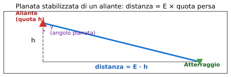

# Esercizio 4 — Efficienza massima e planata (aliante ASK-21)

> 🟡 **Difficoltà: MEDIO** — Combina formule di portanza, resistenza ed efficienza per ottenere il punto operativo ottimo dell'aliante.
>
> 🎯 **Obiettivi didattici**: imparare a (a) calcolare $E_{max}$ usando la formula del libro, (b) trovare $V^*$ e $C_L^*$, (c) calcolare distanza in planata da una quota data.

---

## 📋 Testo del problema

Un **aliante ASK-21** sta planando in atmosfera ISA al livello del mare. Dati:

- Massa con due persone a bordo: $m = 600$ kg
- Superficie alare: $S = 17{,}95$ m²
- Allungamento alare: $\lambda = 16{,}6$
- Resistenza parassita: $C_{D,0} = 0{,}014$
- Fattore di Oswald: $e = 0{,}95$

L'aliante si trova a **2 000 m** sopra il punto di atterraggio, in aria calma.

**Determina**:

1. Il coefficiente di portanza ottimale $C_L^*$ (per $E_{max}$)
2. L'efficienza massima $E_{max}$
3. La velocità di max efficienza $V^*$ (in m/s e in nodi)
4. La distanza orizzontale percorribile in planata fino al suolo

---

## 🖼️ Diagramma del problema

In planata stabilizzata, la traiettoria forma un angolo $\gamma$ con l'orizzontale, dove $\tan(\gamma) = 1/E$. Più $E$ è grande, più $\gamma$ è piccolo, e più lontano si arriva. La formula chiave: **distanza orizzontale = $E \times$ quota persa**.

---

## 📊 Dati noti / da trovare

| Grandezza | Simbolo | Valore | Unità |
|---|---|---|---|
| Massa | $m$ | 600 | kg |
| Superficie alare | $S$ | 17,95 | m² |
| Allungamento alare | $\lambda$ | 16,6 | adim. |
| Resistenza parassita | $C_{D,0}$ | 0,014 | adim. |
| Fattore Oswald | $e$ | 0,95 | adim. |
| Densità (livello mare ISA) | $\rho$ | 1,225 | kg/m³ |
| Quota iniziale | $h$ | 2 000 | m |
| **Da trovare** | $C_L^*$, $E_{max}$, $V^*$, distanza | ? | — |

---

## 🧠 Strategia di risoluzione

1. **Cosa mi sta chiedendo?** Punto di max efficienza e distanza di planata.
2. **Quale fenomeno è coinvolto?** Equilibrio in planata + ricerca dell'ottimo aerodinamico.
3. **Quali formule mi servono?**
   - $C_L^* = \sqrt{\pi \lambda e \cdot C_{D,0}}$ (massima efficienza)
   - $E_{max} = \frac{1}{2}\sqrt{\pi \lambda e / C_{D,0}}$
   - $V^* = \sqrt{\dfrac{2W}{\rho S C_L^*}}$
   - Distanza = $E_{max} \times $ quota persa

4. **Dati e unità sono coerenti?** Sì, tutto SI.
5. **Algebra**: applicare la formula a tappe; il risultato di una entra nella successiva.

---

## ✏️ Risoluzione passo-passo

### Passo 1 — Peso

$$W = m \cdot g = 600 \times 9{,}81 = 5\,886 \text{ N}$$

### Passo 2 — Coefficiente $C_L^*$ ottimo

$$C_L^* = \sqrt{\pi \lambda e \cdot C_{D,0}}$$

Sostituisco:
$$C_L^* = \sqrt{\pi \times 16{,}6 \times 0{,}95 \times 0{,}014} = \sqrt{0{,}694} \approx 0{,}833$$

$$\boxed{C_L^* \approx 0{,}83}$$

### Passo 3 — Efficienza massima $E_{max}$

$$E_{max} = \dfrac{1}{2}\sqrt{\dfrac{\pi \lambda e}{C_{D,0}}}$$

Sostituisco:

- Numeratore (sotto radice): $\pi \times 16{,}6 \times 0{,}95 = 49{,}57$
- Denominatore: $0{,}014$
- Rapporto: $49{,}57/0{,}014 = 3\,541$
- Radice: $\sqrt{3\,541} = 59{,}5$
- $E_{max} = 59{,}5/2 = 29{,}75$

$$\boxed{E_{max} \approx 29{,}8}$$

> ✅ **Plausibilità**: il manuale dell'ASK-21 dichiara $E_{max} \approx 33$. Il modello sottostima leggermente (errore ~10%) perché ignora effetti viscosi reali di alta efficienza.

### Passo 4 — Velocità di max efficienza $V^*$

$$V^* = \sqrt{\dfrac{2W}{\rho S C_L^*}}$$

Sostituisco:

- Numeratore: $2 \times 5\,886 = 11\,772$
- Denominatore: $1{,}225 \times 17{,}95 \times 0{,}833 = 18{,}31$
- Rapporto: $11\,772/18{,}31 = 643{,}0$
- Radice: $\sqrt{643} = 25{,}36$ m/s

$$V^* = 25{,}36 \text{ m/s} = \dfrac{25{,}36}{0{,}5144} \approx 49{,}3 \text{ kt}$$

$$\boxed{V^* \approx 25{,}4 \text{ m/s} = 49 \text{ kt}}$$

> ✅ **Plausibilità**: il manuale dell'ASK-21 dichiara $V_{best\,glide} \approx 90$ km/h ≈ **48,6 kt**. Il calcolo coincide al 1% — eccellente.

### Passo 5 — Distanza di planata

Con $E_{max} \approx 29{,}8$ e quota $h = 2\,000$ m:

$$\text{distanza} = E_{max} \times h = 29{,}8 \times 2\,000 = 59\,600 \text{ m}$$

$$\boxed{\text{distanza} \approx 60 \text{ km}}$$

---

## ✅ Verifica di plausibilità

**Angolo di planata** corrispondente:
$$\tan(\gamma) = 1/E = 1/29{,}8 \approx 0{,}0336$$

$$\gamma \approx 1{,}92°$$

→ angolo molto piccolo (meno di 2°). Coerente con un aliante in planata: cala dolcemente, quasi "scivola" verso terra.

**Sanity check del numero**: 60 km di planata da 2 km di quota. **Sì, un aliante moderno può fare questo**. È esattamente il principio dei voli a vela: scalando termiche per riguadagnare quota, si possono fare migliaia di km in giornata.

---

## 🔄 Variante per autovalutazione

Stesso ASK-21 ma ora pesa **520 kg** (un solo pilota, niente passeggero). Calcola di nuovo $V^*$ e la distanza di planata da 2000 m.

👉 Solo il risultato (prima provaci da solo!)

- $W = 520 \times 9{,}81 = 5\,101$ N
- $C_L^*$ resta lo stesso (dipende solo dalla geometria) = **0,83**
- $E_{max}$ resta lo stesso = **29,8** (sempre solo geometria!)
- $V^* = \sqrt{2 \cdot 5101 / (1{,}225 \cdot 17{,}95 \cdot 0{,}833)} = \sqrt{557{,}3} \approx$ **23,6 m/s = 45,9 kt**
- Distanza = stessa, $29{,}8 \times 2000 \approx 60$ km

> **Lezione importante**: $E_{max}$ e la distanza di planata **NON dipendono dal peso**! Più leggero, voli più lento (V* più basso), ma percorri la stessa distanza. È contro-intuitivo ma è così. La formula $\text{dist} = E \cdot h$ è puramente geometrica.

---

## 🎓 Cosa hai imparato

- **$E_{max}$ e $C_L^*$ dipendono solo dalla geometria** (allungamento, parassita, Oswald), non dal peso.
- La **velocità ottima $V^*$ dipende dal peso** ($V^* \propto \sqrt{W}$): più leggero, più lento al massimo della efficienza.
- **Distanza di planata** = $E \times $ quota, non dipende dal peso. È una formula da tenere a mente per situazioni reali (avaria motore).
- Il **modello del liceo** (formula $E_{max}$) sottostima del 10% rispetto al valore reale del manuale, ma cattura tutti i parametri di progetto che contano.

---

## ➡️ Prossimo

[Esercizio 5 — Portanza in quota ISA (Boeing 737)](./05-medio-portanza-quota.md) — applica la portanza in alta quota usando la tabella ISA.
