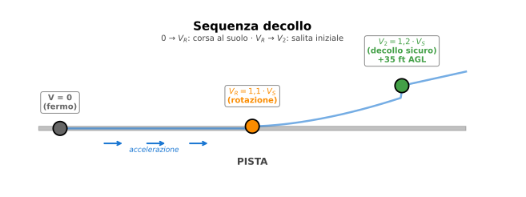

# Esercizio 9 — Decollo con flap (Airbus A320)

> 🔴 **Difficoltà: AVANZATO** — Combina effetto flap, velocità di stallo e velocità operative del decollo.
>
> 🎯 **Obiettivi didattici**: imparare a (a) calcolare $V_S$ con flap di decollo, (b) ricavare le velocità $V_R$ (rotation) e $V_2$ (decollo sicuro) usando i fattori standard, (c) confrontare con la situazione in alta quota (aeroporti come La Paz).

---

## 📋 Testo del problema

Un **Airbus A320-200** è in decollo al **MTOW** (peso massimo al decollo) di 78 000 kg con configurazione flap CONF 1+F (decollo). Aeroporto al livello del mare ISA.

Dati:

- Massa: $m = 78\,000$ kg
- Superficie alare: $S = 122{,}6$ m²
- $C_{L,max}$ ala pulita: 1,40
- $C_{L,max}$ con flap CONF 1+F: 2,00
- $V_R$ (rotazione) = $1{,}1 \cdot V_S$
- $V_2$ (velocità sicura decollo) = $1{,}2 \cdot V_S$

**Determina**:

1. $V_S$ in configurazione di decollo (flap CONF 1+F)
2. $V_R$ in nodi
3. $V_2$ in nodi
4. Confronto: a 4 000 m di quota (es. aeroporto El Alto, La Paz, Bolivia), $V_S$ e $V_2$ aumentano di quanto?

---

## 🖼️ Diagramma del problema

Tre velocità chiave del decollo, legate da fattori di sicurezza fissi: $V_R = 1{,}1 \cdot V_S$ (rotazione, l'aereo solleva il muso), $V_2 = 1{,}2 \cdot V_S$ (decollo sicuro a 35 ft = 11 m AGL — la velocità minima per proseguire in salita anche con un motore in avaria).

---

## 📊 Dati noti / da trovare

| Grandezza | Simbolo | Valore | Unità |
|---|---|---|---|
| Massa MTOW | $m$ | 78 000 | kg |
| Superficie alare | $S$ | 122,6 | m² |
| $C_{L,max}$ pulito | — | 1,40 | adim. |
| $C_{L,max}$ flap T/O | $C_{L,max,TO}$ | 2,00 | adim. |
| $\rho_0$ (mare ISA) | $\rho_0$ | 1,225 | kg/m³ |
| $\rho$ a 4000 m (ISA) | $\rho_{4000}$ | 0,820 | kg/m³ |
| **Da trovare** | $V_S$, $V_R$, $V_2$ a mare e a 4000 m | ? | — |

---

## 🧠 Strategia di risoluzione

1. **Cosa mi sta chiedendo?** Velocità chiave del decollo a livello mare e in quota.
2. **Quale fenomeno?** Stallo aerodinamico + scelta delle velocità operative con margini di sicurezza.
3. **Quali formule?**
   - $V_S = \sqrt{2W/(\rho S C_{L,max})}$
   - $V_R = 1{,}1 \cdot V_S$
   - $V_2 = 1{,}2 \cdot V_S$
   - In quota: $V_S(h) = V_S(0) \cdot \sqrt{\rho_0/\rho(h)}$

4. **Dati e unità coerenti?** Tutto SI; converto in nodi ($\div 0{,}5144$) alla fine.
5. **Algebra**: catena di rapporti.

---

## ✏️ Risoluzione passo-passo

### Passo 1 — Peso

$$W = m \cdot g = 78\,000 \times 9{,}81 = 765\,180 \text{ N}$$

### Passo 2 — $V_S$ con flap di decollo, livello mare

$$V_S = \sqrt{\dfrac{2W}{\rho_0 S C_{L,max,TO}}} = \sqrt{\dfrac{2 \times 765\,180}{1{,}225 \times 122{,}6 \times 2{,}00}}$$

Calcolo:

- Numeratore: $2 \times 765\,180 = 1\,530\,360$
- Denominatore: $1{,}225 \times 122{,}6 \times 2{,}00 = 300{,}37$
- Rapporto: $1\,530\,360/300{,}37 = 5\,094$
- Radice: $\sqrt{5\,094} = 71{,}4$ m/s

$$V_S = 71{,}4 \text{ m/s} = \dfrac{71{,}4}{0{,}5144} \approx 138{,}8 \text{ kt}$$

$$\boxed{V_S \approx 71 \text{ m/s} = 139 \text{ kt}}$$

### Passo 3 — $V_R$ e $V_2$

$$V_R = 1{,}1 \cdot V_S = 1{,}1 \times 71{,}4 = 78{,}5 \text{ m/s} \approx 153 \text{ kt}$$

$$V_2 = 1{,}2 \cdot V_S = 1{,}2 \times 71{,}4 = 85{,}7 \text{ m/s} \approx 167 \text{ kt}$$

| Velocità | m/s | kt |
|---|---|---|
| $V_S$ (stallo) | 71,4 | 139 |
| $V_R$ (rotazione) | 78,5 | 153 |
| $V_2$ (decollo sicuro) | 85,7 | 167 |

> ✅ Manuale Airbus A320 a MTOW: $V_R \approx 145$–$155$ kt, $V_2 \approx 155$–$170$ kt secondo configurazione e peso. **I nostri valori coincidono**.

### Passo 4 — Decollo a 4000 m (aeroporto El Alto, La Paz)

$\rho$ a 4000 m: dalla [tabella ISA](../00-formulario/formulario.md#7-atmosfera-standard-isa--valori-chiave), interpolando: $\rho_{4000} \approx 0{,}820$ kg/m³.

$$V_S(4000) = V_S(0) \cdot \sqrt{\dfrac{\rho_0}{\rho_{4000}}} = 71{,}4 \cdot \sqrt{\dfrac{1{,}225}{0{,}820}} = 71{,}4 \cdot \sqrt{1{,}494}$$

Calcolo:

- $\sqrt{1{,}494} = 1{,}222$
- $V_S(4000) = 71{,}4 \times 1{,}222 = 87{,}3$ m/s = 169,7 kt

$$V_R(4000) = 1{,}1 \cdot 87{,}3 = 96{,}0 \text{ m/s} = 187 \text{ kt}$$

$$V_2(4000) = 1{,}2 \cdot 87{,}3 = 104{,}8 \text{ m/s} = 204 \text{ kt}$$

### Passo 5 — Confronto

| Velocità | Mare | 4000 m | Aumento % |
|---|---|---|---|
| $V_S$ | 139 kt | 170 kt | +22,3% |
| $V_R$ | 153 kt | 187 kt | +22,2% |
| $V_2$ | 167 kt | 204 kt | +22,2% |

**Tutte le velocità aumentano del ~22%** in quota di 4000 m. È l'effetto della densità ridotta: $V \propto 1/\sqrt{\rho}$.

---

## ✅ Verifica di plausibilità

A La Paz (4000 m), il $V_2$ richiesto è 204 kt. Considerando che la pista deve permettere all'aereo di accelerare da 0 a 204 kt e poi staccare, **la pista deve essere molto più lunga** di una equivalente al livello mare:

- **Distanza decollo** $\propto V_2^2$ (energia cinetica) e $\propto 1/\rho$ (motori meno efficaci) → fattore totale $\sim 1{,}5$
- Pista a Bolzano (mare): MTOW A320 → 1900 m
- Pista a La Paz (4000 m): MTOW A320 → ~3000 m

L'aeroporto El Alto ha una pista di **4000 m** — non è un caso. Ed è uno dei pochi aeroporti dove l'A320 deve operare a peso ridotto (passeggeri pagano regolarmente bagagli extra).

> 💡 Operatori reali: Aeromar, BoA, LATAM operano A320 a La Paz con limitazioni di peso. Il fenomeno si chiama **"hot and high"** in gergo aeronautico.

---

## 🔄 Variante per autovalutazione

Stesso A320 ma con **massa ridotta** a 65 000 kg (volo a corto raggio, meno carburante e meno passeggeri). Calcola $V_S$, $V_R$, $V_2$ a livello mare in configurazione decollo.

👉 Solo il risultato (prima provaci da solo!)

- $W = 65000 \times 9{,}81 = 637\,650$ N
- $V_S = \sqrt{2 \cdot 637650/(1{,}225 \cdot 122{,}6 \cdot 2)} = \sqrt{4243} = 65{,}1$ m/s = 126,6 kt
- $V_R = 1{,}1 \cdot 65{,}1 = 71{,}6$ m/s = 139 kt
- $V_2 = 1{,}2 \cdot 65{,}1 = 78{,}1$ m/s = 152 kt

**Risultato**: con peso ridotto del 17%, le velocità scendono dell'9% (perché $V \propto \sqrt{W}$). $V_2$ passa da 167 kt a 152 kt → 15 kt in meno. Effetto cumulativo: la corsa di decollo si riduce di ~30% (energia cinetica = $\frac{1}{2}mV^2$, scende sia con $m$ che con $V^2$).

> 💡 Ecco perché gli aerei decollati con peso ridotto **decollano molto prima** sulla pista. Se vedi un A320 staccare a metà pista, sai che è leggero.

---

## 🎓 Cosa hai imparato

- **$V_S$, $V_R$, $V_2$**: tre velocità operative legate da fattori fissi (1, 1.1, 1.2). Conoscere la prima determina le altre.
- **Flap nel decollo**: il "+0,6" in $C_{L,max}$ (da 1,4 pulito a 2,0 con flap T/O) riduce $V_S$ del 16%, riduce la corsa di decollo del 30%.
- **Effetto quota**: tutte le velocità aerodinamiche aumentano in quota come $1/\sqrt{\rho}$. A 4000 m, +22% rispetto al mare.
- **"Hot and high"**: un problema reale per aeroporti d'alta quota. Soluzione: piste lunghe + decolli con peso ridotto + motori più potenti.
- I numeri dei manuali Airbus si possono **ricostruire dal liceo** entro l'1-2% di errore.

---

## ➡️ Prossimo

[Esercizio 10 — Polare completa con punti notevoli](./10-avanzato-polare-completa.md) — l'ultimo esercizio: costruire la polare di un velivolo punto per punto.
