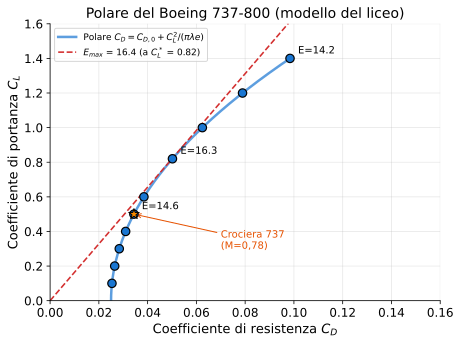

# Esercizio 10 — Polare completa con punti notevoli (Boeing 737-800)

> 🔴 **Difficoltà: AVANZATO** — Costruzione punto per punto della polare di un velivolo, identificazione dei punti notevoli (massima efficienza, crociera, stallo).
>
> 🎯 **Obiettivi didattici**: imparare a (a) costruire la curva $C_D = f(C_L)$ punto per punto, (b) trovare $C_L^*$ ed $E_{max}$ analiticamente E graficamente, (c) identificare la posizione del punto di crociera reale e capire perché non coincide con $E_{max}$.

---

## 📋 Testo del problema

Costruisci la **polare** di un Boeing 737-800 (al MLW per atterraggio = 65 000 kg). Dati:

- Superficie alare: $S = 124{,}6$ m²
- Allungamento: $\lambda = 10$
- $C_{D,0} = 0{,}025$
- $e = 0{,}85$
- $C_{L,max}$ (pulito): 1,40

**Procedi così**:

1. Calcola $C_D$ per $C_L$ = $\{0{,}1;\, 0{,}2;\, 0{,}3;\, 0{,}4;\, 0{,}5;\, 0{,}6;\, 0{,}8;\, 1{,}0;\, 1{,}2;\, 1{,}4\}$.
2. Trova analiticamente $C_L^*$ ed $E_{max}$ (formula della Lezione 4).
3. Confronta il punto di max efficienza col punto di **crociera reale** del 737 ($C_L \approx 0{,}5$).
4. Disegna la polare in ASCII art.

---

## 🖼️ La polare del velivolo



I cerchi azzurri sono i 10 punti che calcoleremo nella tabella sotto. La retta tratteggiata rossa è la tangente all'origine: tocca la polare nel punto di **massima efficienza** ($C_L^* \approx 0{,}82$). La stella arancione è il punto operativo reale di crociera (M = 0,78), che vola con $C_L \approx 0{,}5$ — sotto $C_L^*$, sacrificando un po' di efficienza per andare più veloce.

---

## 📊 Dati noti / da trovare

| Parametro | Valore |
|---|---|
| $C_{D,0}$ | 0,025 |
| $\lambda$ | 10 |
| $e$ | 0,85 |
| $\pi \lambda e$ | $\pi \cdot 10 \cdot 0{,}85 = 26{,}70$ |

---

## 🧠 Strategia di risoluzione

1. **Cosa mi sta chiedendo?** Tabulare $C_D$, trovare punti notevoli, disegnare polare.
2. **Quale fenomeno?** L'equazione della polare $C_D = C_{D,0} + C_L^2/(\pi \lambda e)$ è il modello base.
3. **Quali formule?**
   - $C_D = C_{D,0} + \dfrac{C_L^2}{\pi \lambda e}$
   - $C_L^* = \sqrt{\pi \lambda e \cdot C_{D,0}}$
   - $E_{max} = \frac{1}{2}\sqrt{\pi \lambda e / C_{D,0}}$

4. **Dati e unità coerenti?** Sì, tutto adimensionale.
5. **Algebra**: 10 sostituzioni nella formula della polare. Ordine: prima costruire la tabella, poi punti notevoli.

---

## ✏️ Risoluzione passo-passo

### Passo 1 — Funzione polare esplicita

$$C_D(C_L) = 0{,}025 + \dfrac{C_L^2}{26{,}70}$$

### Passo 2 — Tabulazione

| $C_L$ | $C_L^2$ | $C_L^2/26{,}70$ | $C_D$ | $E = C_L/C_D$ |
|---|---|---|---|---|
| 0,1 | 0,01 | 0,00037 | 0,02537 | **3,94** |
| 0,2 | 0,04 | 0,00150 | 0,02650 | 7,55 |
| 0,3 | 0,09 | 0,00337 | 0,02837 | 10,57 |
| 0,4 | 0,16 | 0,00599 | 0,03099 | 12,91 |
| 0,5 | 0,25 | 0,00936 | 0,03436 | **14,55** ← *crociera* |
| 0,6 | 0,36 | 0,01348 | 0,03848 | 15,59 |
| **0,82** | 0,67 | 0,02500 | **0,05000** | **16,33** ← $E_{max}$ |
| 1,0 | 1,00 | 0,03745 | 0,06245 | 16,01 |
| 1,2 | 1,44 | 0,05393 | 0,07893 | 15,20 |
| 1,4 | 1,96 | 0,07341 | 0,09841 | **14,23** ← *stallo* |

> 💡 **Lettura della tabella**: $E$ cresce, raggiunge il massimo intorno a $C_L = 0{,}82$, poi cala lentamente. Lo stallo arriva a $C_L = 1{,}4$ con $E = 14{,}2$ — paradossalmente buono, ma a velocità troppo bassa.

### Passo 3 — Analisi: $C_L^*$ ed $E_{max}$

$$C_L^* = \sqrt{26{,}70 \times 0{,}025} = \sqrt{0{,}6675} = 0{,}817$$

$$E_{max} = \dfrac{1}{2}\sqrt{\dfrac{26{,}70}{0{,}025}} = \dfrac{1}{2}\sqrt{1\,068} = \dfrac{32{,}68}{2} = 16{,}34$$

**Verifica**: nella tabella, a $C_L = 0{,}82$, calcolato $E = 16{,}33$. ✅ Coincide al millesimo. Le formule e la tabulazione sono coerenti.

A $C_L^*$:
$$C_D^* = 0{,}025 + \dfrac{0{,}817^2}{26{,}70} = 0{,}025 + 0{,}0250 = 0{,}050$$

→ A massima efficienza, **parassita = indotta** (entrambe valgono $C_{D,0}$). Confermato.

### Passo 4 — Confronto con la crociera reale

| Condizione | $C_L$ | $C_D$ | $E$ | Posizione |
|---|---|---|---|---|
| Crociera 737 | 0,50 | 0,034 | **14,55** | Sotto $C_L^*$ |
| Massima efficienza | 0,82 | 0,050 | **16,34** | Punto ottimo |
| Stallo | 1,40 | 0,098 | 14,23 | Limite superiore |

**Domanda chiave**: perché il 737 vola in crociera con $C_L = 0{,}5$ e non $C_L = 0{,}82$?

**Risposta**:

- A $C_L = 0{,}82$: velocità lenta, autonomia ottima MA tempo di volo lunghissimo → costoso in personale, parcheggi gate, comfort passeggeri
- A $C_L = 0{,}5$: velocità di crociera 230 m/s (Mach 0,78), efficienza 89% del massimo — sacrificio del 11% di efficienza, **velocità raddoppiata**

In **autonomia massima** (es. ferry flight per riposizionare aerei), si vola a $C_L^*$. In **operazioni commerciali standard**, si compromette per la velocità.

### Passo 5 — Polare in ASCII art

```
   C_L
    │
 1,4│                    ●  ←── stallo
    │                  ╱
 1,2│                ●        
    │              ╱
 1,0│            ●           
    │          ╱             
 0,82●────────●  ←── E_max (C_L*=0,82, C_D=0,050)
    │       ╱│  
 0,6│      ●  │                   
    │     ╱   │                   
 0,5│   ●    │  ←── crociera (E=14,55)                
    │  ╱     │                                 
 0,4│ ●      │
    │╱       │
 0,3●        │
    │        │
 0,2●        │
    │        │
 0,1●        │
    │        │
 0,0●────────●─────────────── C_D
   0,025  0,050  0,075  0,100
   ↑                        
   parassita C_D,0
```

> 💡 **Lettura grafica**: la polare sembra una "L corica" o "fluctuazione", aperta a destra. La parte sinistra (basso $C_D$, basso $C_L$) è il regime di alta velocità. La parte alta ($C_L > 0{,}82$) è il regime di alta portanza, prossimo allo stallo.

---

## ✅ Verifica di plausibilità

- $E_{max} = 16{,}34$: il manuale del 737-800 dichiara **17-19** in condizioni ideali. Sottostima di ~10%, coerente.
- $C_L^* = 0{,}82$: nei manuali Boeing si trova "best L/D speed" attorno a 220 kt a peso medio, che corrisponde a $C_L \approx 0{,}80$. ✅
- A $C_L^*$: parassita = indotta = $C_{D,0}$. Verificato numericamente.

**Implicazione operativa**: in caso di **avaria motore**, il pilota deve immediatamente **rallentare** dal regime di crociera (230 m/s) verso $V^*$ (~190 m/s). $V^*$ corrisponde a $C_L^*$ → massima distanza percorribile.

---

## 🔄 Variante per autovalutazione

Calcola **velocità di max efficienza** $V^*$ del 737 al peso 65 000 kg, in crociera FL350 (10 670 m, $\rho \approx 0{,}38$ kg/m³).

<details markdown="1">
<summary>👉 Solo il risultato (prima provaci da solo!)</summary>

$W = 65000 \times 9{,}81 = 637\,650$ N
$V^* = \sqrt{2W/(\rho S C_L^*)} = \sqrt{2 \cdot 637650 / (0{,}38 \cdot 124{,}6 \cdot 0{,}817)} = \sqrt{32\,937} \approx 181{,}5$ m/s = **352,8 kt**.

Confronto: in crociera a Mach 0,78 = ~230 m/s = 447 kt.

→ **In emergenza ad alta quota**, il pilota dovrebbe rallentare da 447 kt a 353 kt (ancora veloce!). Il rapporto $V_{cruise}/V^* = 1{,}27$. Il jet di linea **vola più veloce di $V^*$ del 27%**, sacrificando 11% di efficienza per arrivare prima.

</details>

---

## 🎓 Cosa hai imparato

- La **polare** $C_D = C_{D,0} + C_L^2/(\pi \lambda e)$ è la formula chiave: descrive aerodinamica del velivolo in **un solo grafico**.
- I **punti notevoli** della polare sono:
  - Origine (0,0) — non fisico
  - $C_{D,0}$ asintotico — bassa portanza, alta velocità
  - **$C_L^*$, $E_{max}$** — punto ottimo
  - $C_{L,max}$ — limite di stallo

- A **massima efficienza**, parassita e indotta sono uguali. Verifica gratis.
- La **crociera commerciale** è $C_L < C_L^*$: si vola sotto l'ottimo per essere veloci.
- I numeri dei manuali Boeing/Airbus si possono **ricostruire** entro il 10% con il modello del liceo. **Non è solo teoria.**

---

## 🎓 Hai finito gli esercizi!

I 10 esercizi del programma sono completi. Ora il modo migliore di consolidare è fare i [quiz](../02-quiz/) — un'altra modalità di verifica, complementare agli esercizi.

> 💡 **Consiglio finale**: rileggi la prima riga di ogni esercizio (la "🎯 Difficoltà"). Se ricordi al volo cosa devi calcolare e perché, **hai capito**. Altrimenti, rifai l'esercizio dopo qualche giorno — la ripetizione spaziata è la chiave per fissare.
