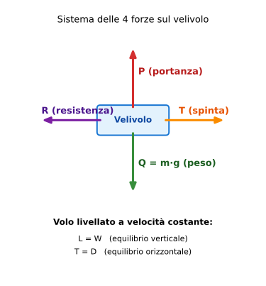

# Esercizio 11 — Coefficiente di portanza in crociera (Cirrus SR22)

> 🟢 **Difficoltà: BASE** — Variante dell'[Esercizio 1](../01-base-portanza-cessna.md) con un velivolo più moderno e veloce.
>
> 🎯 **Obiettivi didattici**: confrontare un velivolo moderno con il Cessna classico, vedere come dati diversi cambiano $C_L$ richiesto, allenarsi sulla stessa formula in contesto nuovo.

---

## 📋 Testo del problema

Un **Cirrus SR22 G6** (velivolo da turismo top di gamma in fibra di vetro) vola in **crociera livellata** al livello del mare in atmosfera standard. Dati:

- Massa di crociera: $m = 1\,500$ kg
- Superficie alare: $S = 13{,}5$ m²
- Velocità di crociera: $V = 183$ kt (significativamente più veloce del Cessna 172)

**Determinare il coefficiente di portanza $C_L$ richiesto** per mantenere il volo livellato.

---

## 🖼️ Diagramma del problema

Stesso schema dell'Esercizio 1 (Cessna): equilibrio $L = W$ verticale e $T = D$ orizzontale.

---

## 📊 Dati noti / da trovare

| Grandezza | Simbolo | Valore | Unità |
|---|---|---|---|
| Massa | $m$ | 1 500 | kg |
| Superficie alare | $S$ | 13,5 | m² |
| Velocità | $V$ | 183 | kt |
| Densità (livello mare ISA) | $\rho$ | 1,225 | kg/m³ |
| Accelerazione gravità | $g$ | 9,81 | m/s² |
| **Da trovare** | $C_L$ | ? | adim. |

---

## 🧠 Strategia di risoluzione

1. **Cosa cerchi?** Il $C_L$ in crociera del Cirrus.
2. **Fenomeno?** Equilibrio in volo livellato: $L = W$.
3. **Formule:**
   - $W = m \cdot g$
   - $L = \frac{1}{2}\rho V^2 S C_L$ → $C_L = \dfrac{2W}{\rho V^2 S}$
4. **Unità:** velocità in nodi → convertire in m/s prima.
5. **Algebra:** sostituzione numerica diretta.

---

## ✏️ Risoluzione passo-passo

### Passo 1 — Conversione velocità
$$V = 183 \text{ kt} \times 0{,}5144 = 94{,}13 \text{ m/s}$$

### Passo 2 — Peso
$$W = 1\,500 \times 9{,}81 = 14\,715 \text{ N}$$

### Passo 3 — Equilibrio: $L = W$

### Passo 4 — Formula isolata
$$C_L = \dfrac{2W}{\rho V^2 S}$$

### Passo 5 — Sostituzione numerica

$$C_L = \dfrac{2 \times 14\,715}{1{,}225 \times (94{,}13)^2 \times 13{,}5}$$

A tappe:

- Numeratore: $2 \times 14\,715 = 29\,430$
- $(94{,}13)^2 = 8\,860{,}5$
- $1{,}225 \times 8\,860{,}5 = 10\,854{,}1$
- Denominatore: $10\,854{,}1 \times 13{,}5 = 146\,530$
- $C_L = 29\,430 / 146\,530 = 0{,}2008$

### Passo 6 — Risultato

$$\boxed{C_L \approx 0{,}20}$$

---

## ✅ Verifica di plausibilità

Dal [formulario, sezione 9](../../00-formulario/formulario.md#9-coefficienti-tipici-ordine-di-grandezza): velivolo GA in crociera → $C_L \in [0{,}2;\, 0{,}4]$. **Il nostro 0,20 sta proprio sul limite inferiore** ✅, coerente con un velivolo veloce in crociera economica.

### Confronto col Cessna 172 (Esercizio 1)

| | Cessna 172 | Cirrus SR22 | Rapporto |
|---|---|---|---|
| Massa | 1043 kg | 1500 kg | +44% |
| Superficie alare | 16,2 m² | 13,5 m² | -17% |
| Velocità crociera | 122 kt | 183 kt | +50% |
| **Carico alare** $W/S$ | 64 kg/m² | 111 kg/m² | +73% |
| **$C_L$ in crociera** | 0,26 | 0,20 | -23% |

**Lettura**: il Cirrus, nonostante pesi di più, ha **$C_L$ minore** del Cessna. Perché? Perché vola **molto più veloce**: $V^2$ del Cirrus è $1{,}5^2 = 2{,}25$ volte quello del Cessna, e questo compensa abbondantemente l'aumento di peso. **A velocità maggiori, il coefficiente di portanza necessario scende drasticamente** (relazione inversa quadratica: $C_L \propto W/V^2$).

---

## 🔄 Variante per autovalutazione

Stesso Cirrus, ma in **salita iniziale** subito dopo il decollo a velocità ridotta $V = 100$ kt. Calcola $C_L$.

👉 Solo il risultato (prima provaci da solo!)

$V = 100 \times 0{,}5144 = 51{,}44$ m/s
$C_L = 2 \cdot 14715 / (1{,}225 \cdot 51{,}44^2 \cdot 13{,}5) = 29430 / 43\,748 \approx$ **0,673**

→ A velocità ridotta della metà (rispetto a 200 kt), il $C_L$ richiesto **quadruplica**: passa da 0,17 (200 kt teorici) a 0,67 a 100 kt. Sotto a 75 kt il Cirrus stalla con ala pulita ($C_{L,max} \approx 1{,}5$ → $V_S \approx 70$ kt). Per atterrare il Cirrus usa flap.

---

## 🎓 Cosa hai imparato

- **Stessa formula** della portanza, dati diversi → risultato diverso, ma metodologia identica.
- I **velivoli moderni veloci** (Cirrus, TBM, Pilatus PC-12) hanno **carico alare alto** ($W/S$ ~110+ kg/m²) e $C_L$ basso in crociera.
- Più veloce voli, **meno $C_L$ ti serve** per portare lo stesso peso. Ma c'è un limite: la velocità di stallo non scende mai sotto $V_S = \sqrt{2W/(\rho S C_{L,max})}$.
- I dati di un velivolo specifico li trovi sul **POH (Pilot's Operating Handbook)**, non nel formulario.

---

## ➡️ Prossimo

Vai all'[indice esercizi](../tutti.md) e scegli un'altra variante che ti incuriosisce, oppure prova [Esercizio 12 — Stallo Cessna con flap T/O](./12-base-stallo-cessna-flap.md).
