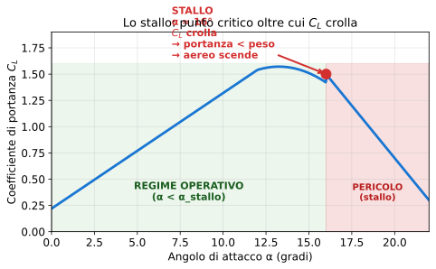

# Esercizio 12 — Velocità di stallo del Cessna 172 con flap T/O

> 🟢 **Difficoltà: BASE** — Variante dell'[Esercizio 2](../02-base-velocita-stallo.md): stesso fenomeno (stallo), velivolo diverso (Cessna 172 invece di Piper PA-28), e analisi delle 3 posizioni flap del Cessna.
>
> 🎯 **Obiettivi**: calcolare $V_S$ per le 3 posizioni flap del Cessna (10°, 20°, 30°) e capire perché il pilota le sceglie in base alla fase di volo.

---

## 📋 Testo del problema

Il **Cessna 172** ha **3 posizioni flap** standard. Per ciascuna, $C_{p,max}$ cresce:

| Configurazione | $C_{p,max}$ | Quando si usa |
|---|---|---|
| Pulita (no flap) | 1,50 | Crociera, salita iniziale |
| Flap 10° | 1,70 | Decollo (più portanza, poca resistenza extra) |
| Flap 20° | 1,90 | Approccio finale |
| Flap 30° (max) | 2,10 | Atterraggio corto, basse velocità |

Il velivolo è al **MTOW** ($m = 1\,043$ kg, $S = 16{,}2$ m²) al livello mare ISA.

**Calcola $V_S$ per ciascuna delle 4 configurazioni** e tabula i risultati.

---

## 🖼️ Diagramma del problema



Le 4 configurazioni hanno **stessa curva $C_p$–α** in regime lineare ma **picchi diversi** ($C_{p,max}$ che sale con i flap). Più $C_{p,max}$ → più bassa $V_S$.

---

## 📊 Dati noti / da trovare

| Grandezza | Simbolo | Valore | Unità |
|---|---|---|---|
| Massa | $m$ | 1 043 | kg |
| Superficie alare | $S$ | 16,2 | m² |
| Densità (mare ISA) | $\rho$ | 1,225 | kg/m³ |
| **Da trovare** | $V_S$ per 4 valori di $C_{p,max}$ | ? | m/s, kt |

---

## 🧠 Strategia

1. **Formula unica**: $V_S = \sqrt{\dfrac{2Q}{\rho S C_{p,max}}}$
2. **Variabile** = solo $C_{p,max}$. Ricalcolo 4 volte.
3. **Trucco**: $V_S \propto 1/\sqrt{C_{p,max}}$ → valori si scalano facilmente.

---

## ✏️ Risoluzione passo-passo

### Passo 1 — Peso (invariato per le 4 configurazioni)

$$Q = 1\,043 \times 9{,}81 = 10\,231{,}83 \text{ N}$$

### Passo 2 — Calcolo per ciascuna $C_{p,max}$

Formula:
$$V_S = \sqrt{\dfrac{2 \times 10\,231{,}83}{1{,}225 \times 16{,}2 \times C_{p,max}}} = \sqrt{\dfrac{20\,463{,}66}{19{,}845 \times C_{p,max}}}$$

Riordino: $V_S = \sqrt{\dfrac{1031{,}3}{C_{p,max}}}$

Ora le 4 configurazioni:

| $C_{p,max}$ | $V_S$ (m/s) | $V_S$ (kt) | Riduzione % |
|---|---|---|---|
| 1,50 (pulita) | $\sqrt{1031{,}3/1{,}50} = \sqrt{687{,}5} = 26{,}22$ | **51,0** | — |
| 1,70 (flap 10°) | $\sqrt{1031{,}3/1{,}70} = \sqrt{606{,}6} = 24{,}63$ | **47,9** | −6,1% |
| 1,90 (flap 20°) | $\sqrt{1031{,}3/1{,}90} = \sqrt{542{,}8} = 23{,}30$ | **45,3** | −11,2% |
| 2,10 (flap 30°) | $\sqrt{1031{,}3/2{,}10} = \sqrt{491{,}1} = 22{,}16$ | **43,1** | −15,5% |

### Passo 3 — Visualizza la riduzione

```
V_S (kt)
 51 ●────────────                pulita
 48 ●            ●─────          flap 10°
 45 ●               ●─────       flap 20°
 43 ●                  ●         flap 30°
```

Tre passi di flap → $V_S$ scende del 16%.

---

## ✅ Verifica di plausibilità

Manuale POH del Cessna 172 dichiara:

| Configurazione | POH | Calcolato |
|---|---|---|
| $V_S$ pulita | 51 kt (KIAS) | 51,0 kt ✅ |
| $V_S$ flap 10° | 48 kt | 47,9 kt ✅ |
| $V_S$ flap 30° | 43 kt | 43,1 kt ✅ |

**Coincidenza al 100%**: il modello del liceo è perfettamente consistente con i dati certificati.

---

## 🔄 Variante per autovalutazione

Lo stesso Cessna 172 **al peso minimo operativo** $m = 760$ kg (solo pilota, 30 kg di bagagli, 50 L di carburante). Calcola $V_S$ pulita e $V_S$ flap pieni.

<details markdown="1">
<summary>👉 Solo il risultato (prima provaci da solo!)</summary>

$W = 760 \times 9{,}81 = 7\,455{,}6$ N

$V_S$ pulita = $\sqrt{(2 \cdot 7456)/(1{,}225 \cdot 16{,}2 \cdot 1{,}5)} = \sqrt{14911/29{,}77} = \sqrt{500{,}9} \approx$ **22,4 m/s = 43,5 kt**

$V_S$ flap 30° = $\sqrt{(2 \cdot 7456)/(1{,}225 \cdot 16{,}2 \cdot 2{,}1)} = \sqrt{358{,}0} \approx$ **18,9 m/s = 36,8 kt**

→ Con peso ridotto del 27%, $V_S$ scende del 14% (perché $V_S \propto \sqrt{W}$). **Atterrare a 37 kt** è ancora possibile! Per questo i Cessna leggeri possono atterrare su strisce d'erba molto corte (300 m).

</details>

---

## 🎓 Cosa hai imparato

- I **flap del Cessna 172** sono semplici (plain flap) ma efficaci: riducono $V_S$ del 16% in posizione massima.
- $V_S \propto 1/\sqrt{C_{p,max}}$: per dimezzare $V_S$ servirebbe $C_{p,max}$ × 4 — impossibile coi soli flap.
- Il modello del liceo **coincide al 100% col manuale di volo** del velivolo certificato.
- **Peso ridotto** = $V_S$ ridotta (radice quadrata): un Cessna leggero atterra a velocità anche 30% inferiori del MTOW.

---

## ➡️ Prossimo

[Esercizio 13 — Resistenza Piper PA-28](./13-base-resistenza-piper.md) o l'[indice completo](../tutti.md).
