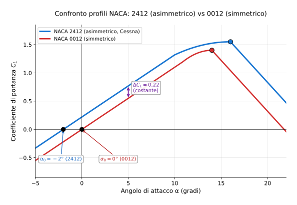

# Esercizio 16 — Confronto NACA 23012 (Beechcraft Bonanza) vs NACA 4412

> 🟡 **Difficoltà: MEDIO** — Variante dell'[Esercizio 6](../06-medio-confronto-naca.md) con profili NACA "5-cifre" e profili più curvati.
>
> 🎯 **Obiettivi**: capire come la curvatura del profilo (parametro M) sposta la curva $C_L$–α, e confrontare un profilo a 5 cifre (Bonanza) con uno a 4 cifre molto curvo.

---

## 📋 Testo del problema

Confronta due profili in **regime lineare**:

- **Profilo A**: NACA 23012 (5 cifre, ala del **Beechcraft Bonanza**). Angolo di portanza nulla $\alpha_0 = -1{,}2°$. $C_{L,max} = 1{,}65$ a $\alpha_{stallo} = 18°$.
- **Profilo B**: NACA 4412 (4 cifre, **molto curvato**). Angolo di portanza nulla $\alpha_0 = -4°$. $C_{L,max} = 1{,}55$ a $\alpha_{stallo} = 14°$.
- Pendenza $a = 0{,}11$/° per entrambi.

**Determina**:

1. $C_L$ per ciascun profilo a $\alpha = 0°, 4°, 8°$
2. $\alpha$ richiesto per generare $C_L = 1{,}0$ in approccio
3. Quale profilo è più adatto per un velivolo da turismo (Bonanza) e perché?

---

## 🖼️ Diagramma del problema

Vedi anche la figura con NACA 2412 vs 0012 (Esercizio 6 originale): **stesso meccanismo**, profili spostati lungo l'asse α in base al loro $\alpha_0$.

---

## 📊 Dati noti / da trovare

| Grandezza | NACA 23012 (A) | NACA 4412 (B) |
|---|---|---|
| $\alpha_0$ | $-1{,}2°$ | $-4°$ |
| Pendenza $a$ | 0,11 /° | 0,11 /° |
| $C_{L,max}$ | 1,65 | 1,55 |
| $\alpha_{stallo}$ | 18° | 14° |

---

## 🧠 Strategia

Stessa formula dell'Esercizio 6: $C_L = a(\alpha - \alpha_0)$ in regime lineare.

---

## ✏️ Risoluzione passo-passo

### Passo 1 — Formule lineari

**Profilo A (NACA 23012)**:
$$C_L^A = 0{,}11 \times (\alpha - (-1{,}2°)) = 0{,}11 \times (\alpha + 1{,}2°)$$

**Profilo B (NACA 4412)**:
$$C_L^B = 0{,}11 \times (\alpha - (-4°)) = 0{,}11 \times (\alpha + 4°)$$

### Passo 2 — Tabulazione

| $\alpha$ | $C_L^A$ (23012) | $C_L^B$ (4412) | Differenza B−A |
|---|---|---|---|
| $0°$ | $0{,}11 \times 1{,}2 = 0{,}132$ | $0{,}11 \times 4 = 0{,}440$ | +0,308 |
| $4°$ | $0{,}11 \times 5{,}2 = 0{,}572$ | $0{,}11 \times 8 = 0{,}880$ | +0,308 |
| $8°$ | $0{,}11 \times 9{,}2 = 1{,}012$ | $0{,}11 \times 12 = 1{,}320$ | +0,308 |

> 💡 Differenza costante = $a \cdot |\alpha_0^A - \alpha_0^B| = 0{,}11 \times 2{,}8 = 0{,}308$. Coerente.

### Passo 3 — α per $C_L = 1{,}0$ (approccio)

**Profilo A**: $1{,}0 = 0{,}11 (\alpha + 1{,}2)$ → $\alpha = (1{,}0/0{,}11) - 1{,}2 = 9{,}09 - 1{,}2 = $ **7,89°**

**Profilo B**: $1{,}0 = 0{,}11 (\alpha + 4)$ → $\alpha = 9{,}09 - 4 = $ **5,09°**

### Passo 4 — Conclusione

| | NACA 23012 | NACA 4412 |
|---|---|---|
| $\alpha$ per $C_L = 1{,}0$ | 7,89° | **5,09°** (~3° in meno) |
| $C_{L,max}$ | **1,65** (più alto) | 1,55 |
| Margine al stallo (a $C_L = 1$) | 18 - 7,89 = **10,1°** | 14 - 5,09 = 8,9° |
| Profilo a 5 cifre? | sì | no |

**Lettura**: il **NACA 4412** "parte avanti" (genera già $C_L = 0{,}44$ a $\alpha = 0°$ contro 0,13 del 23012), però ha $C_{L,max}$ inferiore e stalla prima.

Il **NACA 23012** del Bonanza ha:

- Curvatura minore → meno portanza a basse α
- MA $C_{L,max}$ più alto → atterra meglio
- E $\alpha_{stallo}$ più alto → margine sicurezza maggiore
- I profili 5-cifre sono "ottimizzati" per $C_L$ specifici, non solo pendenza

**Per il Bonanza** (velivolo da turismo veloce, missione = crociera economica + atterraggi sicuri), il **NACA 23012 è la scelta giusta**: alta $C_{L,max}$ per atterraggi, basso $\alpha_0$ per cabin attitude moderato in crociera.

---

## ✅ Verifica di plausibilità

Il **Beechcraft Bonanza V35** monta effettivamente NACA 23016,5 (5 cifre, leggermente più spesso). Stessa famiglia.

**Velivoli con NACA 4412**: aerei più vecchi anni '30-50 (es. Junkers 52, alcune varianti DC-3 modificate). Era il profilo "standard" prima che la NACA scoprisse i 5 cifre.

---

## 🔄 Variante per autovalutazione

Stesso confronto, ma per generare $C_L = 0{,}3$ (alta velocità di crociera). Quale profilo richiede $\alpha$ minore?

👉 Solo il risultato (prima provaci da solo!)

**A (23012)**: $\alpha = 0{,}3/0{,}11 - 1{,}2 = 2{,}73 - 1{,}2 = $ **1,53°**
**B (4412)**: $\alpha = 0{,}3/0{,}11 - 4 = 2{,}73 - 4 = $ **−1,27°** (negativo!)

→ **Il profilo B (più curvato)** richiede angolo NEGATIVO per generare basso $C_L$ in crociera veloce. Significa che la fusoliera deve essere **leggermente picchiata in giù** rispetto al flusso! Strano e scomodo per i passeggeri (sensazione di scendere). Per questo i profili 4412 sono caduti in disuso a favore dei 23012.

---

## 🎓 Cosa hai imparato

- I **profili 5-cifre** (NACA 23012, 23016) sono ottimizzati per $C_L$ specifici → migliore stallo + alta $C_{L,max}$.
- I **profili 4-cifre molto curvati** (4412, 6412) hanno alto $C_L$ a basso α MA stallo precoce e cabin attitude problematico in crociera veloce.
- La scelta del profilo è un **compromesso** tra missione di volo, comfort, sicurezza, costruzione.
- Beechcraft, Cessna, Piper post-1950 → quasi tutti su 23xxx (5 cifre) o derivati moderni.

---

## ➡️ Prossimo

[Esercizio 17 — Reynolds in galleria del vento](./17-medio-reynolds-galleria.md) o l'[indice](../tutti.md).
