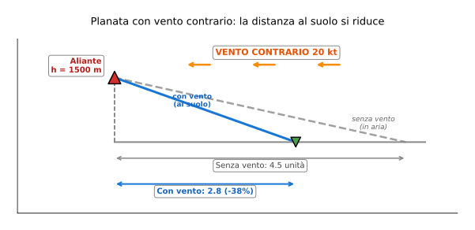

# Esercizio 20 — Planata Boeing 787 con vento al traverso

> 🔴 **Difficoltà: AVANZATO** — Variante dell'[Esercizio 8](../08-avanzato-planata-aliante.md): planata con vento, ma con una **componente perpendicolare** invece di solo contrario, e su un widebody.
>
> 🎯 **Obiettivi**: scomporre il vento in componenti contrario/traverso, calcolare l'effetto del solo vento contrario sulla distanza al suolo, e capire perché il pilota cambia rotta (crab angle) per compensare.

---

## 📋 Testo del problema

Un **Boeing 787-9 Dreamliner** rimane senza propulsione (avaria doppia molto rara) a **FL370** (11 278 m) con peso $m = 220\,000$ kg. Sta dirigendo verso un aeroporto di emergenza a **180 km di distanza** in linea retta.

Vento a quota: **70 kt da 30° rispetto alla rotta** (cioè non puramente contrario, ma diagonale).

Dati 787:

- Superficie alare: $S = 360{,}5$ m²
- Allungamento: $\lambda = 11$
- $C_{R,0} = 0{,}023$, $e = 0{,}87$
- $C_p^* = \sqrt{\pi \lambda e \cdot C_{R,0}} \approx 0{,}845$
- $E_{max} = 0{,}5 \sqrt{\pi \lambda e/C_{R,0}} \approx 18{,}5$
- $\rho$ a 11 278 m ≈ 0,358 kg/m³

**Determina**:

1. La componente di vento **contraria alla rotta** ($V_{wind,||}$) e quella **al traverso** ($V_{wind,\perp}$)
2. La distanza in planata in **aria calma** dal FL370
3. La distanza al suolo con vento contrario (componente parallela)
4. Riesce ad arrivare a destinazione (180 km)?
5. Discussione: come gestisce il pilota la componente al traverso?

---

## 🖼️ Diagramma del problema

**Ma qui il vento è a 30°**, quindi devo prima scomporlo in due componenti perpendicolari (parallela alla rotta + perpendicolare).

---

## 📊 Dati noti / da trovare

| Grandezza | Valore |
|---|---|
| Massa | 220 000 kg |
| Quota | 11 278 m |
| Aeroporto distanza | 180 km |
| Vento totale | 70 kt da 30° rispetto rotta |

---

## 🧠 Strategia

1. **Scomposizione vettoriale del vento** (trigonometria): componente parallela $V_{||}$ e perpendicolare $V_\perp$
2. **Distanza calma** = $E_{max} \times h$
3. **Distanza con vento parallelo** = riduzione del fattore $V_{ground}/V^*$ (Esercizio 8)
4. La componente al traverso NON cambia la distanza percorsa, ma richiede al pilota di **virare di crab angle**

---

## ✏️ Risoluzione passo-passo

### Passo 1 — Scomposizione del vento

$V_{wind} = 70$ kt = 36,01 m/s. Angolo $\theta = 30°$.

**Componente parallela** (contraria alla rotta):
$$V_{||} = V_{wind} \cdot \cos(\theta) = 36{,}01 \times \cos(30°) = 36{,}01 \times 0{,}866 \approx 31{,}19 \text{ m/s}$$

**Componente perpendicolare** (al traverso):
$$V_\perp = V_{wind} \cdot \sin(\theta) = 36{,}01 \times \sin(30°) = 36{,}01 \times 0{,}500 \approx 18{,}01 \text{ m/s}$$

→ Componente contraria 31,2 m/s = **60,6 kt** (significativa!).

### Passo 2 — Distanza in aria calma

$$\text{distanza}_{calma} = E_{max} \times h = 18{,}5 \times 11\,278 = 208\,643 \text{ m} \approx 209 \text{ km}$$

→ In aria calma, il 787 raggiunge facilmente l'aeroporto a 180 km. **Ma c'è il vento contrario.**

### Passo 3 — Velocità ottima del 787 a peso 220 t e FL370

$$V^* = \sqrt{\dfrac{2Q}{\rho S C_p^*}} = \sqrt{\dfrac{2 \times 220\,000 \times 9{,}81}{0{,}358 \times 360{,}5 \times 0{,}845}}$$

Calcolo:

- Numeratore: $4\,316\,400$
- Denominatore: $0{,}358 \times 360{,}5 \times 0{,}845 = 109{,}05$
- Rapporto: $39\,581$
- $V^* = \sqrt{39\,581} = 198{,}9$ m/s ≈ **387 kt** (TAS)

### Passo 4 — Velocità al suolo (componente parallela)

$$V_{ground} = V^* - V_{||} = 198{,}9 - 31{,}2 = 167{,}7 \text{ m/s}$$

### Passo 5 — Velocità verticale (rateo di discesa)

$$V_z = V^*/E_{max} = 198{,}9/18{,}5 = 10{,}75 \text{ m/s}$$

→ Tempo per scendere a 0 m: $t = h/V_z = 11\,278/10{,}75 = 1\,049$ s ≈ 17,5 minuti.

### Passo 6 — Distanza al suolo

$$\text{distanza}_{suolo} = V_{ground} \times t = 167{,}7 \times 1\,049 = 175\,920 \text{ m} \approx 176 \text{ km}$$

### Passo 7 — Riesce ad arrivare?

$$\boxed{\text{distanza al suolo} \approx 176 \text{ km}}$$

Aeroporto a **180 km**. **No, manca di 4 km!**

→ **Decisione operativa**: il pilota deve trovare un aeroporto più vicino, oppure provare ad accelerare leggermente sopra $V^*$ per "tagliare" il vento (tecnica MacCready dell'Esercizio 8). Calcolo veloce: a $V_2 = 215$ m/s ($+8\%$ sopra $V^*$), $E$ scende a ~$0{,}9 E_{max} = 16{,}7$, $V_z$ sale a 12,9 m/s, $t = 875$ s, $V_{ground} = 215 - 31{,}2 = 183{,}8$ m/s, distanza = $183{,}8 \times 875 = 160\,825$ m = 161 km. **Ancora peggio**.

In realtà, la velocità ottima MacCready con vento contrario di 31 m/s sarebbe $V_{best} \approx V^* + V_{||}/2 = 199 + 15{,}6 = 214{,}5$ m/s → distanza ~165 km.

**Conclusione**: con questo specifico vento contrario, il 787 NON arriva a destinazione. Il pilota deve dichiarare emergenza e atterrare al primo aeroporto utile entro ~170 km.

### Passo 8 — La componente al traverso

I 18 m/s perpendicolari NON cambiano la distanza percorsa lungo la rotta diretta (dimostrabile vettorialmente: la velocità nell'aria è sempre $V^*$ in direzione del moto).

**MA** il pilota deve **puntare il muso** in una direzione leggermente diversa dalla rotta, per compensare la deriva. Questo angolo si chiama **crab angle**:

$$\beta = \arctan\left(\dfrac{V_\perp}{V_{ground}}\right) = \arctan\left(\dfrac{18{,}01}{167{,}7}\right) = \arctan(0{,}107) \approx 6{,}1°$$

→ Il pilota tiene il muso **6° fuori asse** rispetto all'aeroporto, "scivolando" lateralmente nel vento per arrivare dritto.

---

## ✅ Verifica di plausibilità

**Caso reale**: il **TACA Flight 110** (1988), Boeing 737-300, perse entrambi i motori a 16 500 ft per ingestione di acqua dopo un temporale. Planò per **circa 80 km** prima di atterrare su una diga. $E$ effettiva ~ 20, distanza ~ 100 km in calma, ridotta da venti turbolenti.

**Per il 787** con $E_{max} \approx 18{,}5$, da FL370 (11,3 km), planata teorica massima ~209 km — un cerchio enorme di possibili aeroporti. Il vento contrario forte ne riduce significativamente il raggio.

---

## 🔄 Variante per autovalutazione

Stesso 787, stessa quota, stesso vento, ma il pilota **accelera leggermente** a $V = 220$ m/s (sopra $V^*$). Stima:

a. Nuova efficienza $E$ (assumi $E(V) = 0{,}88 \cdot E_{max}$ a $V = 1{,}1 V^*$)
b. Nuova velocità verticale $V_z$
c. Tempo di volo
d. Distanza al suolo

👉 Solo il risultato (prima provaci da solo!)

a. $E = 0{,}88 \cdot 18{,}5 = 16{,}3$
b. $V_z = V/E = 220/16{,}3 = 13{,}50$ m/s
c. $t = 11278/13{,}50 = 835$ s = 13,9 min
d. $V_{ground} = 220 - 31{,}2 = 188{,}8$ m/s
distanza = $188{,}8 \times 835 = 157\,668$ m ≈ **158 km**

→ Conferma: accelerando si arriva ancora più corti (158 km vs 176 km a $V^*$). **Volare a $V^*$ resta la scelta migliore**, ma con vento contrario di 30+ m/s non basta per i 180 km. Il pilota deve scegliere un aeroporto più vicino.

---

## 🎓 Cosa hai imparato

- Il vento "obliquo" si scompone in **componente parallela** (riduce/aumenta distanza) e **perpendicolare** (richiede crab angle).
- Componente parallela 60+ kt è un problema serio anche per un widebody con $E = 18$.
- Anche un velivolo intercontinentale come il 787 ha **limiti di planata** ben definiti dalla quota e dal vento.
- **Crab angle** $\beta = \arctan(V_\perp/V_{ground})$ è la tecnica di compensazione laterale.
- In emergenza, il pilota usa il **glide range circle** sull'EFB (electronic flight bag) per sapere quali aeroporti sono raggiungibili in tempo reale, considerando anche il vento.

---

## ➡️ Prossimo

[Esercizio 21 — A320 da Cuzco (alta quota)](./21-avanzato-cuzco.md) o l'[indice](../tutti.md).
