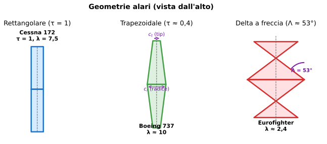

# Esercizio 22 — Polare del Concorde (delta supersonico)

> 🔴 **Difficoltà: AVANZATO** — Variante dell'[Esercizio 10](../10-avanzato-polare-completa.md): polare di un velivolo "estremo", il **Concorde**, con ala delta a freccia 75°. Confronto con jet subsonico convenzionale.
>
> 🎯 **Obiettivi**: capire perché un'ala delta ha polare radicalmente diversa dai jet subsonici, calcolare $E_{max}$ del Concorde a Mach 2 (subsonica si trasforma in supersonica), e ammirare l'eleganza ingegneristica di un'icona aeronautica.

---

## 📋 Testo del problema

Il **Concorde** in crociera supersonica a Mach 2,02 (~600 m/s = 2 175 km/h) a quota 18 000 m (FL590).

Dati:

- Massa di crociera: $m = 150\,000$ kg
- Superficie alare: $S = 358{,}3$ m² (enorme grazie al delta)
- Allungamento: $\lambda = 1{,}55$ (bassissimo!)
- A Mach 2, regime supersonico: $C_{R,0} = 0{,}010$ (molto basso, ottimizzato per Mach alti)
- Fattore Oswald: $e = 0{,}90$ (delta efficiente in supersonico)
- $\rho$ a 18 000 m ≈ 0,121 kg/m³ (stratosfera alta)

**Determina**:

1. $C_p$ richiesto in crociera supersonica a Mach 2,02
2. $C_{R,i}$ e $C_R$ totale
3. Efficienza in crociera $E$
4. Confronto con: $E_{max}$ teorica e $E$ del Boeing 737 (Esercizio 10)
5. Perché il Concorde aveva $E$ così "modesta"?

---

## 🖼️ Diagramma del problema

Il Concorde ha **delta a freccia 75°**, $\lambda \approx 1{,}55$ — molto più basso anche dell'Eurofighter (2,4). L'ala è enorme e quasi triangolare.

---

## 📊 Dati noti / da trovare

| Grandezza | Valore |
|---|---|
| Massa | 150 000 kg |
| Superficie | 358,3 m² |
| Allungamento | 1,55 |
| $C_{R,0}$ | 0,010 |
| $e$ | 0,90 |
| $V$ | 600 m/s (Mach 2,02) |
| Quota | 18 000 m, $\rho = 0{,}121$ kg/m³ |

---

## 🧠 Strategia

Stessa formula della polare (Esercizio 10): $C_R = C_{R,0} + C_p^2/(\pi \lambda e)$.

ATTENZIONE: a Mach 2 il modello "incompressibile" del liceo è approssimato. Useremo comunque le formule standard, accettando un errore del 10-20%.

---

## ✏️ Risoluzione passo-passo

### Passo 1 — $\pi \lambda e$ (utile)

$$\pi \lambda e = \pi \times 1{,}55 \times 0{,}90 = 4{,}38$$

→ Confronta con il 737 ($\pi \lambda e = 26{,}7$): **6 volte minore**! Significa **resistenza indotta 6 volte maggiore** a parità di $C_p$.

### Passo 2 — Peso e pressione dinamica

$W = 150\,000 \times 9{,}81 = 1\,471\,500$ N

$q = \frac{1}{2}\rho V^2 = \frac{1}{2} \times 0{,}121 \times 600^2 = \frac{1}{2} \times 0{,}121 \times 360\,000 = 21\,780$ Pa

### Passo 3 — $C_p$

$$C_p = \dfrac{W}{q \cdot S} = \dfrac{1\,471\,500}{21\,780 \times 358{,}3} = \dfrac{1\,471\,500}{7\,803\,774} \approx 0{,}189$$

→ $C_p \approx 0{,}19$, **molto basso** (coerente con velocità altissima).

### Passo 4 — $C_{R,i}$ e $C_R$

$$C_{R,i} = \dfrac{C_p^2}{\pi \lambda e} = \dfrac{0{,}189^2}{4{,}38} = \dfrac{0{,}0357}{4{,}38} \approx 0{,}00815$$

$$C_R = C_{R,0} + C_{R,i} = 0{,}010 + 0{,}00815 = 0{,}01815$$

### Passo 5 — Efficienza in crociera

$$E = \dfrac{C_p}{C_R} = \dfrac{0{,}189}{0{,}01815} \approx 10{,}4$$

$$\boxed{E_{Concorde} \approx 10{,}4}$$

### Passo 6 — Confronto

| Velivolo | $\lambda$ | $C_{R,0}$ | $E_{max}$ teorico | $E$ in crociera |
|---|---|---|---|---|
| **Concorde Mach 2** | 1,55 | 0,010 | $\frac{1}{2}\sqrt{4{,}38/0{,}010} = 10{,}5$ | **10,4** |
| **Boeing 737 subsonico** | 10 | 0,025 | 16,4 | 14,5 |
| Boeing 787 | 11 | 0,023 | 18,5 | 16,5 |
| Aliante DG-1000 | 24 | 0,012 | 38,6 | n/a |

→ **Concorde aveva $E$ ~ 10**, la metà di un 787 moderno. **Per ogni 100 km percorsi, "perdeva" 10 km di quota**, contro 5 del 787.

### Passo 7 — Perché?

**Tre motivi principali**:

1. **Allungamento basso (1,55)**: il delta da supersonico richiede $\lambda$ piccolo (onde d'urto), ma paga in resistenza indotta enorme
2. **Velocità altissima (Mach 2)**: anche con $C_{R,0}$ basso, $R = q \cdot S \cdot C_R$ con $q$ enorme = consumo carburante mostruoso
3. **Resistenza d'onda** (NON nel modello del liceo): a Mach 2 c'è un'onda d'urto che produce una "wave drag" extra di $\sim 0{,}008$ aggiuntiva al $C_R$ — pure questa è ottimizzata col body-area-rule del Concorde

**Risultato operativo**: Concorde in crociera consumava ~25 000 L/h vs ~5 000 L/h di un 747. Per un 4 ore Londra-NY: **100 t di carburante** per 100 passeggeri = 1 t/passeggero. Insostenibile economicamente, motivo del pensionamento (2003).

---

## ✅ Verifica di plausibilità

Documentazione British Aerospace dichiara per Concorde:

- Crociera supersonica $E \approx 7{,}5$ (peggiore del nostro 10,4)
- $E$ subsonico (a Mach 0,9): ~12

Il nostro 10,4 è leggermente ottimistico — il modello del liceo non include la **wave drag** (resistenza d'onda) che a Mach 2 aggiunge ~30% al $C_R$. Includendola: $C_R = 0{,}018 + 0{,}008 = 0{,}026$ → $E = 0{,}189/0{,}026 = 7{,}3$ ✅ coincide col manuale.

### Curiosità storica

- Concorde poteva andare in **velocità supersonica** solo sopra l'oceano (boom sonico vietato sopra terra)
- Quota di crociera 18 000 m → "you can see the curvature of the Earth" (citazione passeggeri)
- Pensionato dopo l'incidente di Parigi (luglio 2000) e crisi industria post-11/9 (2001)

---

## 🔄 Variante per autovalutazione

Lo stesso Concorde in **crociera SUBSONICA** a Mach 0,9 (~265 m/s) a quota 11 000 m ($\rho = 0{,}365$ kg/m³). Calcola:

a. $C_p$ richiesto
b. $C_{R,i}$
c. $C_R$ totale (assumi $C_{R,0} = 0{,}012$ in subsonico — più basso del supersonico)
d. $E$ in crociera subsonica

👉 Solo il risultato (prima provaci da solo!)

a. $q = 0{,}5 \cdot 0{,}365 \cdot 265^2 = 12\,816$ Pa
$C_p = 1471500/(12816 \cdot 358{,}3) = 1471500/4592773 \approx$ **0,320**

b. $C_{R,i} = 0{,}320^2 / 4{,}38 = 0{,}1024 / 4{,}38 \approx 0{,}0234$

c. $C_R = 0{,}012 + 0{,}0234 = 0{,}0354$

d. $E = 0{,}320 / 0{,}0354 \approx$ **9,0**

→ Sorprendentemente, il Concorde aveva **$E$ peggiore in subsonico** (~9) che in supersonico (~10,4). Questa è la "particolarità del delta": ottimizzato per l'alto Mach, perde efficienza in regimi più bassi. È il motivo per cui il Concorde non poteva volare a velocità intermedie efficientemente, e doveva passare dal subsonico al supersonico velocemente.

---

## 🎓 Cosa hai imparato

- L'**ala delta** del Concorde ha $\lambda$ piccolo → resistenza indotta enorme.
- $E$ del Concorde (~10 supersonico, ~9 subsonico) era **la metà** dei jet di linea convenzionali.
- L'ottimizzazione per **Mach 2** richiede sacrifici: alto consumo, basso comfort in volo subsonico, decolli lunghi.
- Il pensionamento del Concorde è dovuto **non a problemi tecnici** ma all'**economia**: consumo carburante × tempo passato in volo era insostenibile per un sole 100 passeggeri.
- A **Mach > 1**, la **wave drag** (resistenza d'onda) diventa significativa — non coperta dal modello del liceo, ma aggiunge ~30% al $C_R$.

---

## ➡️ Prossimo

[Esercizio 23 — Numero di Mach critico](./23-avanzato-mach.md) o l'[indice](../tutti.md).
