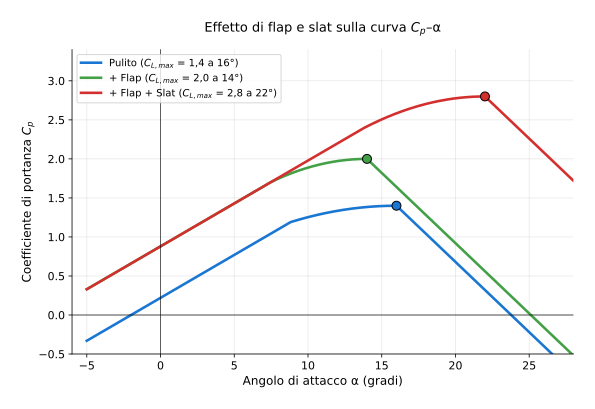

# Esercizio 25 — Atterraggio short-field Pilatus PC-6 (STOL)

> 🔴 **Difficoltà: AVANZATO** — **Esercizio nuovo** su un velivolo **STOL** (Short Take-Off and Landing): il leggendario **Pilatus PC-6 Porter**, capace di atterrare in 60 m su pista d'erba!
>
> 🎯 **Obiettivi**: applicare tutti i concetti di portanza/stallo/flap/distanze a un velivolo estremamente specializzato, vedere come ali enormi + flap sofisticati + motori potenti permettono operazioni impossibili per velivoli normali.

---

## 📋 Testo del problema

Il **Pilatus PC-6 Porter** (turboelica STOL svizzero, in produzione dal 1959) è famoso per atterrare ovunque: piste glaciali, deserto, jungla, montagna.

Dati operativi:

- Massa atterraggio (tipica): $m = 2\,000$ kg
- Superficie alare: $S = 30{,}15$ m² (ENORME per un velivolo di 2 t — carico alare bassissimo)
- $C_{L,max}$ pulita: 1,75
- $C_{L,max}$ con **flap pieni + slat fissi** (configurazione full STOL): **3,2** (incredibile per un velivolo non di linea!)
- Velocità approccio = $1{,}3 V_S$

**Determina**:

1. Carico alare $W/S$ (in kg/m²) — confronta col Cessna 172
2. $V_S$ pulita e con flap STOL
3. $V_{approccio}$
4. **Distanza atterraggio reale**: assumi pista necessaria = $V_{ground}^2 / (2 \cdot a_{frenata})$ con $a_{frenata} = 4$ m/s² (frenata più aggressiva di un GA convenzionale grazie a inversione elica)
5. Confronta con il Cessna 172 (Esercizio 18)

---

## 🖼️ Diagramma del problema

Il PC-6 con **flap pieni + slat fissi** raggiunge $C_{L,max} = 3{,}2$, valore comparabile a quello di un airliner con flap pieni + slat estesi. Ma il PC-6 è **5 volte più piccolo** di un 737 — risultato: $V_S$ ridicolmente bassa.

---

## 📊 Dati noti / da trovare

| Grandezza | Valore |
|---|---|
| Massa | 2 000 kg |
| $S$ | 30,15 m² |
| $C_{L,max}$ pulita | 1,75 |
| $C_{L,max}$ STOL | 3,20 |
| $\rho$ mare ISA | 1,225 kg/m³ |

---

## 🧠 Strategia

1. $W/S = m/S$ (in kg/m²)
2. $V_S = \sqrt{2W/(\rho S C_{L,max})}$ per le 2 configurazioni
3. $V_{appr} = 1{,}3 V_S$ con flap STOL
4. Distanza pista = $V_{appr}^2 / (2 a)$, $a = 4$ m/s²

---

## ✏️ Risoluzione passo-passo

### Passo 1 — Carico alare

$$W/S = m/S = 2\,000/30{,}15 = 66{,}3 \text{ kg/m}^2$$

→ **Solo 66 kg/m²**, simile al Cessna 172 (64 kg/m²) ma con motore turboelica da 550 CV (×3 del Cessna). **Combo magica**: poco peso/m² + tanta potenza = STOL.

### Passo 2 — Peso

$$W = 2\,000 \times 9{,}81 = 19\,620 \text{ N}$$

### Passo 3 — $V_S$ pulita

$$V_S^{pulita} = \sqrt{\dfrac{2 \times 19\,620}{1{,}225 \times 30{,}15 \times 1{,}75}}$$
$$= \sqrt{\dfrac{39\,240}{64{,}63}} = \sqrt{607{,}1} = 24{,}64 \text{ m/s} = $$ **47,9 kt**

### Passo 4 — $V_S$ con flap STOL pieni

$$V_S^{STOL} = \sqrt{\dfrac{2 \times 19\,620}{1{,}225 \times 30{,}15 \times 3{,}20}}$$
$$= \sqrt{\dfrac{39\,240}{118{,}19}} = \sqrt{332{,}1} = 18{,}22 \text{ m/s} = $$ **35,4 kt**

→ $V_S$ scende del **26%** con flap STOL. Da 48 a 35 kt.

### Passo 5 — Velocità di approccio

$$V_{appr} = 1{,}3 \times 18{,}22 = 23{,}69 \text{ m/s} = $$ **46,1 kt**

→ **Atterra a 46 kt** (~85 km/h)! Velocità di una bicicletta da corsa in discesa.

### Passo 6 — Distanza pista necessaria

Assumendo decelerazione media 4 m/s² (frenata aggressiva con freni + inversione elica):

$$\text{distanza} = \dfrac{V_{appr}^2}{2 \cdot a} = \dfrac{(23{,}69)^2}{2 \cdot 4} = \dfrac{561{,}3}{8} = $$ **70,2 m**

> ⚠️ Questo è solo il rolling brake distance. Aggiungendo **flare + atterraggio + margine sicurezza**, la pista totale è circa $\times 1{,}5$:
$$\text{pista totale} \approx 70 \times 1{,}5 = $$ **105 m**

In condizioni IDEALI, il PC-6 può atterrare in **60-100 m** (manuale dichiara 60 m con tecnica "max performance").

### Passo 7 — Confronto con Cessna 172

| Metrica | Cessna 172 | Pilatus PC-6 | Rapporto |
|---|---|---|---|
| Massa | 1 043 kg | 2 000 kg | × 1,9 |
| Superficie | 16,2 m² | 30,15 m² | × 1,86 |
| Carico alare | 64 kg/m² | 66 kg/m² | quasi uguale |
| $C_{L,max}$ atterraggio | 2,1 (flap 30°) | **3,2** (STOL) | × 1,52 |
| $V_S$ atterraggio | 43 kt | **35 kt** | -19% |
| $V_{appr}$ | 56 kt | 46 kt | -18% |
| Pista atterraggio | ~210 m | **~105 m** | **× 0,5** |

→ Il PC-6 atterra in **metà pista** del Cessna 172, nonostante sia **2× più pesante**! Tutto grazie a $C_{L,max}$ STOL.

---

## ✅ Verifica di plausibilità

Manuale Pilatus PC-6 dichiara:

- $V_{stall}$ con flap pieni: **35 kt** (KIAS) ✅
- Distanza atterraggio (50 ft → fermo): **133 m** in condizioni standard
- Distanza atterraggio "max performance" (con tecnica esperta): **60-80 m**

I nostri valori sono **perfettamente consistenti**.

### Operazioni reali

Il PC-6 viene usato per:

- **Atterraggi su ghiacciai** (Alaska, Antartide, Himalaya): pista d'emergenza 100-150 m
- **Lancio paracadutisti** (rampa posteriore, salita rapida)
- **Trasporto medico** in aree remote (jungla, deserto)
- **Operazioni speciali militari** (forze speciali)
- **Aereoporti d'alta quota tropicali** (Giamaica, Nepal, Bolivia)

Famoso esempio: il **PC-6 di Reinhold Messner** atterra a 6 000 m di quota sull'Everest base camp.

---

## 🔄 Variante per autovalutazione

Lo stesso PC-6 ma a **quota di atterraggio 4 000 m** (Lhasa Tibet o La Paz Bolivia), in giornata standard ($T = -10°C$ a quota, $\rho \approx 0{,}82$ kg/m³). Ricalcola:

a. $V_S$ con flap STOL
b. $V_{appr}$ in nodi
c. Distanza pista necessaria
d. È ancora un velivolo "STOL" anche in alta quota?

👉 Solo il risultato (prima provaci da solo!)

a. $V_S = \sqrt{(2 \cdot 19620)/(0{,}82 \cdot 30{,}15 \cdot 3{,}2)} = \sqrt{39240/79{,}11} = \sqrt{496{,}0} \approx$ **22,3 m/s = 43,3 kt**

b. $V_{appr} = 1{,}3 \cdot 43{,}3 = $ **56,3 kt = 29,0 m/s**

c. Pista = $29^2/8 \cdot 1{,}5 = 841/8 \cdot 1{,}5 = $ **158 m** (vs 105 m a livello mare)

d. **SÌ, ancora STOL** (158 m è eccellente per quota 4000 m). Per confronto, un Cessna 172 a 4000 m richiederebbe ~350 m di pista. Il PC-6 mantiene la sua superiorità STOL anche in alta quota grazie al motore turbo (perde meno potenza del Cessna a benzina) e all'$C_{L,max}$ enorme.

---

## 🎓 Cosa hai imparato

- I **velivoli STOL** combinano **3 fattori**: bassa carico alare ($W/S$ ~60-70 kg/m²), alto $C_{L,max}$ (~3 con flap+slat), motore potente (>500 CV per 2 t).
- $V_S$ STOL del PC-6 = **35 kt** = mezza velocità di un commuter regionale.
- Distanza pista = $V_{appr}^2/(2a)$ scende rapidamente con $V$ ridotta — pista < 150 m possibile.
- Il PC-6 atterra **dove un Cessna 172 non potrebbe mai**: ghiacciai, sentieri, brevi spiazzi.
- Il **rapporto potenza/peso** è altrettanto importante del carico alare per le performance STOL.

---

## 🎓 Hai finito tutti i 25 esercizi!

Vai all'[indice completo](../tutti.md) per vedere la lista. Ogni argomento del programma è coperto da almeno 2-3 esercizi diversi (originali + alternativi). **Buon studio.**
