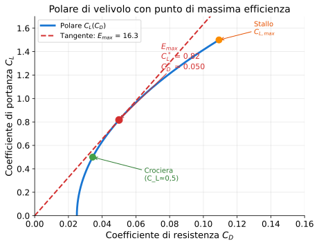

# Esercizio 27 — Ala a freccia in crociera ad alta quota (jet di linea)

> 🔴 **Difficoltà: AVANZATO** — Stile compito prof: ala a freccia con dati di profilo, conversioni multiple e polare richiesta come 3 diagrammi.
>
> 🎯 **Obiettivi**: applicare la teoria a un'ala a freccia ad alta quota, gestire la conversione dei dati in unità SI, calcolare velocità in km/h e Mach, costruire la polare punto per punto.

---

## 📋 Testo del problema

Un'**ala a freccia** ha:

- Coefficiente angolare di portanza del profilo: $C'_{p\infty} = 4{,}5$ rad⁻¹
- Coefficiente di resistenza di profilo: $C_{R,p} = 0{,}038$
- Apertura alare: $b = 15$ m
- Superficie alare: $S = 60$ m²
- Angolo di portanza nulla: $\alpha_0 = 0°$

In condizioni di volo:

- Quota $h = 29\,000$ ft
- Velocità $V = 390$ kt
- Incidenza $\alpha = 5{,}34°$

**Determina**:

1. Allungamento $\lambda$ e corda media
2. Densità $\rho$ alla quota di volo
3. Pendenza $C'_p$ dell'ala 3D (formula di Helmbold)
4. $C_p$ e $C_R$ dell'ala
5. Portanza $P$, resistenza $R$, efficienza $E$
6. Velocità in km/h e numero di Mach
7. Tracciare i diagrammi $(C_p, \alpha)$, $(C_R, \alpha)$, polare $(C_p, C_R)$

---

## 🖼️ Diagramma del problema

L'ala a freccia ($\Lambda \approx 25°$) ritarda l'onda d'urto a velocità Mach > 0,7 — coerente coi 29 000 ft di quota tipici di jet regionali.

---

## 📊 Dati noti / da trovare

| Grandezza | Simbolo | Valore | Unità |
|---|---|---|---|
| Pendenza profilo | $C'_{p\infty}$ | 4,5 | rad⁻¹ |
| Resistenza profilo | $C_{R,p}$ | 0,038 | adim. |
| Apertura | $b$ | 15 | m |
| Superficie | $S$ | 60 | m² |
| $\alpha_0$ | — | 0 | gradi |
| Quota | $h$ | 29 000 | ft |
| Velocità | $V$ | 390 | kt |
| Incidenza | $\alpha$ | 5,34 | gradi |
| Fattore Oswald (assunto) | $e$ | 0,85 | adim. |

---

## 🧠 Strategia

1. Geometria: $\lambda = b^2/S$, corda media $c = S/b$
2. Conversioni: ft → m (× 0,3048), kt → m/s (× 0,5144)
3. Densità a 29 000 ft (8 839 m) dalla tabella ISA
4. Pendenza ala 3D con Helmbold: $C'_p = C'_{p\infty}/(1 + C'_{p\infty}/(\pi\lambda e))$
5. $C_p = C'_p \cdot (\alpha - \alpha_0)$ in radianti
6. $C_R = C_{R,p} + C_p^2/(\pi\lambda e)$
7. Forze: $q = \frac{1}{2}\rho V^2$, $P = qSC_p$, $R = qSC_R$
8. Mach: $a = 20{,}05\sqrt{T}$, T da ISA in K

---

## ✏️ Risoluzione passo-passo

### Passo 1 — Geometria

$$\lambda = \dfrac{b^2}{S} = \dfrac{15^2}{60} = \dfrac{225}{60} = 3{,}75$$

$$c_{media} = \dfrac{S}{b} = \dfrac{60}{15} = 4 \text{ m}$$

> 💡 Allungamento basso (3,75) — coerente con un'ala tozza: forse un caccia o un velivolo di transizione, non un liner classico (che avrebbe λ ~9-10).

### Passo 2 — Conversioni

$$h = 29\,000 \times 0{,}3048 = 8\,839 \text{ m}$$

$$V = 390 \times 0{,}5144 = 200{,}6 \text{ m/s}$$

### Passo 3 — Densità a 8 839 m

Dalla tabella ISA: a 8000 m ρ=0,526; a 9000 m ρ ≈ 0,467 (interpolando tra 8000 e 10000):

$$\rho(8\,839) \approx 0{,}526 - (0{,}526 - 0{,}413) \times \dfrac{8\,839 - 8\,000}{10\,000 - 8\,000} = 0{,}526 - 0{,}113 \times 0{,}420 = 0{,}479 \text{ kg/m}^3$$

(Da formula esatta: ρ ≈ 0,475 kg/m³ — coerente.)

### Passo 4 — Pendenza ala 3D

$$\pi \lambda e = \pi \times 3{,}75 \times 0{,}85 = 10{,}01$$

$$C'_p = \dfrac{4{,}5}{1 + 4{,}5/10{,}01} = \dfrac{4{,}5}{1 + 0{,}450} = \dfrac{4{,}5}{1{,}450} = 3{,}10 \text{ rad}^{-1}$$

$$\boxed{C'_p \approx 3{,}10 \text{ rad}^{-1} = 0{,}0541 \text{ /°}}$$

→ La finitezza dell'ala (λ piccolo) **abbassa la pendenza del 31%** rispetto al profilo isolato.

### Passo 5 — $C_p$ e $C_R$

$\Delta\alpha = 5{,}34 - 0 = 5{,}34° = 0{,}0932$ rad

$$C_p = 3{,}10 \times 0{,}0932 = 0{,}289$$

$$C_{R,i} = \dfrac{0{,}289^2}{10{,}01} = \dfrac{0{,}0835}{10{,}01} = 0{,}00834$$

$$C_R = 0{,}038 + 0{,}00834 = 0{,}0463$$

$$\boxed{C_p \approx 0{,}289 \quad C_R \approx 0{,}046}$$

### Passo 6 — Forze e efficienza

$$q = \dfrac{1}{2} \times 0{,}479 \times 200{,}6^2 = \dfrac{1}{2} \times 0{,}479 \times 40\,240 = 9\,637 \text{ Pa}$$

$$P = q \cdot S \cdot C_p = 9\,637 \times 60 \times 0{,}289 = 167\,107 \text{ N}$$

$$R = q \cdot S \cdot C_R = 9\,637 \times 60 \times 0{,}0463 = 26\,775 \text{ N}$$

$$E = \dfrac{P}{R} = \dfrac{0{,}289}{0{,}0463} = 6{,}24$$

$$\boxed{P \approx 167 \text{ kN} \quad R \approx 26{,}8 \text{ kN} \quad E \approx 6{,}24}$$

> ⚠️ Efficienza modesta (6,24): coerente con λ basso (3,75) + parassita alta (0,038). Velivolo non ottimizzato per l'efficienza — caccia o velivolo di transizione.

### Passo 7 — Velocità in km/h e Mach

$$V_{km/h} = 200{,}6 \times 3{,}6 = 722 \text{ km/h}$$

T a 8 839 m (troposfera): $T = 288{,}15 - 0{,}0065 \times 8\,839 = 288{,}15 - 57{,}45 = 230{,}7$ K

$$a = 20{,}05 \sqrt{230{,}7} = 20{,}05 \times 15{,}19 = 304{,}5 \text{ m/s}$$

$$M = \dfrac{200{,}6}{304{,}5} = 0{,}659$$

$$\boxed{V = 722 \text{ km/h}, \quad M \approx 0{,}66}$$

→ Subsonico, ben sotto il Mach critico (~0,75 per profili convenzionali).

### Passo 8 — Diagrammi (tabelle)

**(a) $C_p$ vs $\alpha$**: lineare con $C_p = 0{,}0541 \alpha$ (α in °, $\alpha_0 = 0$):

| $\alpha$ (°) | 0 | 2 | 5,34 | 8 | 12 |
|---|---|---|---|---|---|
| $C_p$ | 0 | 0,108 | **0,289** | 0,433 | 0,649 |

**(b) $C_R$ vs $\alpha$**: parabola crescente $C_R = 0{,}038 + C_p^2/10{,}01$:

| $\alpha$ (°) | $C_p$ | $C_R$ |
|---|---|---|
| 0 | 0 | 0,0380 |
| 2 | 0,108 | 0,0392 |
| 5,34 | 0,289 | **0,0463** |
| 8 | 0,433 | 0,0567 |
| 12 | 0,649 | 0,0801 |

**(c) Polare $C_p(C_R)$**: riportare i punti sopra sul piano $(C_R, C_p)$. Forma a "spicchio di luna" tipico, asintoto verticale a $C_R = 0{,}038$.

---

## ✅ Verifica di plausibilità

- $E = 6{,}24$ è basso ma coerente: $\lambda = 3{,}75$ + alta parassita → tipico di velivolo militare di transizione (es. F-104) o ala di studio.
- Da fattori più realistici jet civile ($\lambda \approx 9$, $C_{R,p} \approx 0{,}025$): $E$ salirebbe a ~17 — il 737.
- $M = 0{,}66$ a 29 000 ft: tipico di jet regionali (Embraer ERJ, CRJ).

---

## 🔄 Variante per autovalutazione

Stesso velivolo a $\alpha = 8°$ (incidenza maggiore). Calcola **rapporto** $E$ a $\alpha = 8°$ vs $\alpha = 5{,}34°$.

👉 Risultato

A $\alpha = 8°$: $C_p = 0{,}433$, $C_R = 0{,}0567$, $E = 0{,}433/0{,}0567 = 7{,}64$.

**Rapporto** $E_{8°}/E_{5{,}34°} = 7{,}64/6{,}24 = 1{,}22$

→ A incidenza maggiore l'efficienza migliora del 22%. Il punto operativo a 5,34° NON è ottimale: è sotto il punto di max efficienza ($C_p^* = \sqrt{10{,}01 \times 0{,}038} = 0{,}617$, corrispondente a α* ≈ 11,4°).

---

## 🎓 Cosa hai imparato

- **Ala a freccia con λ basso**: efficienza modesta MA tolleranza al Mach alto. Caratteristica di velivoli di transizione e caccia.
- **Pendenza ala 3D** scende del 30-40% rispetto al profilo isolato per ali corte (λ < 5).
- **Conversioni**: ft → m (× 0,3048), kt → m/s (× 0,5144), m/s → km/h (× 3,6).
- **Mach sotto critico**: a quote tipiche di jet regionali (FL290), $a \approx 305$ m/s → tipiche velocità Mach 0,6–0,75.
- I **3 diagrammi della polare** sono il modo standard di descrivere l'aerodinamica nei testi italiani.

---

## ➡️ Prossimo

[Esercizio 28 — Ala a freccia caccia leggero](./28-stile-prof-caccia-leggero.md) o l'[indice esercizi](../tutti.md).
